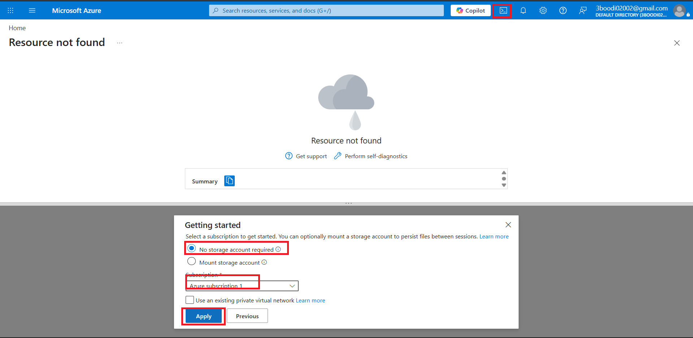
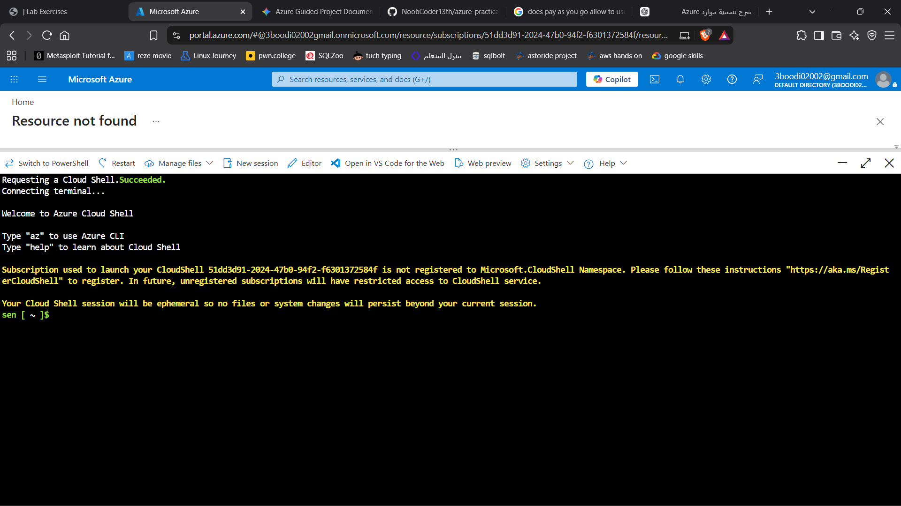
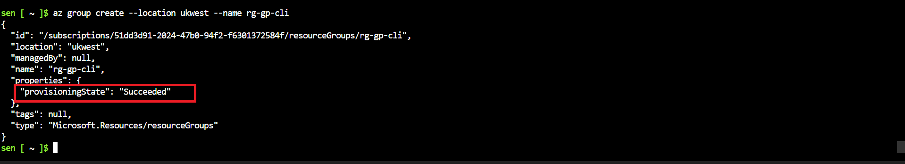
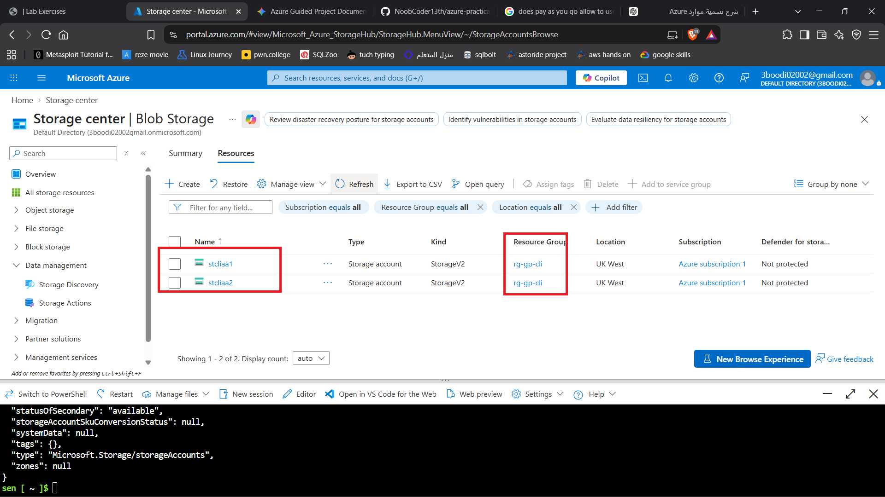
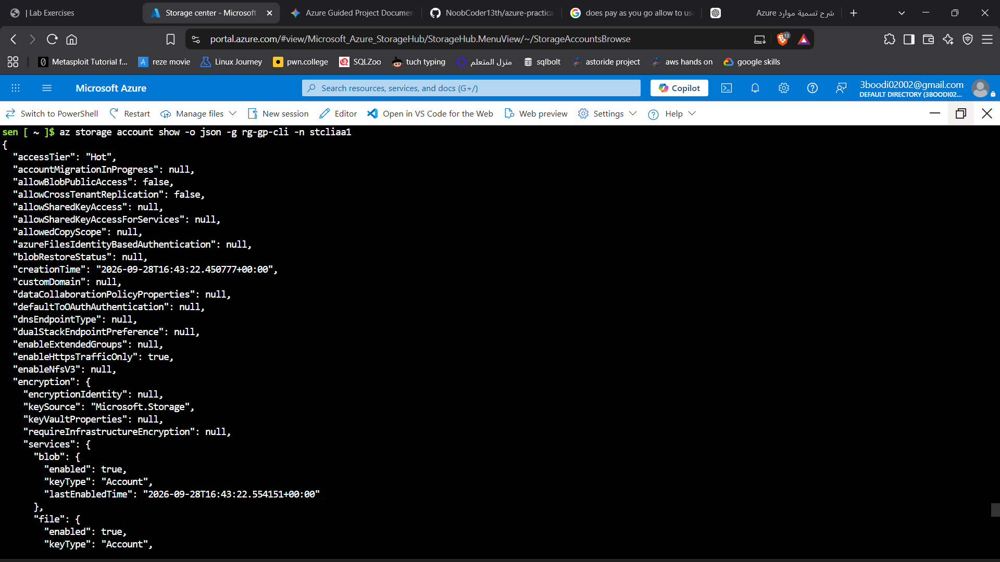
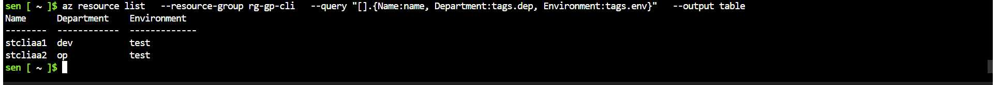
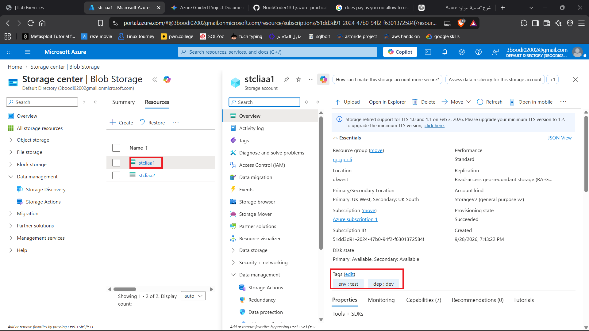
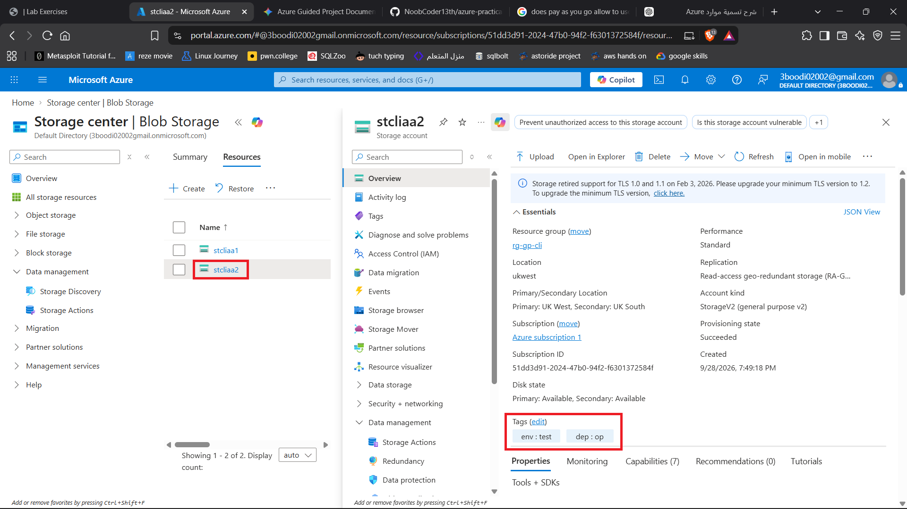
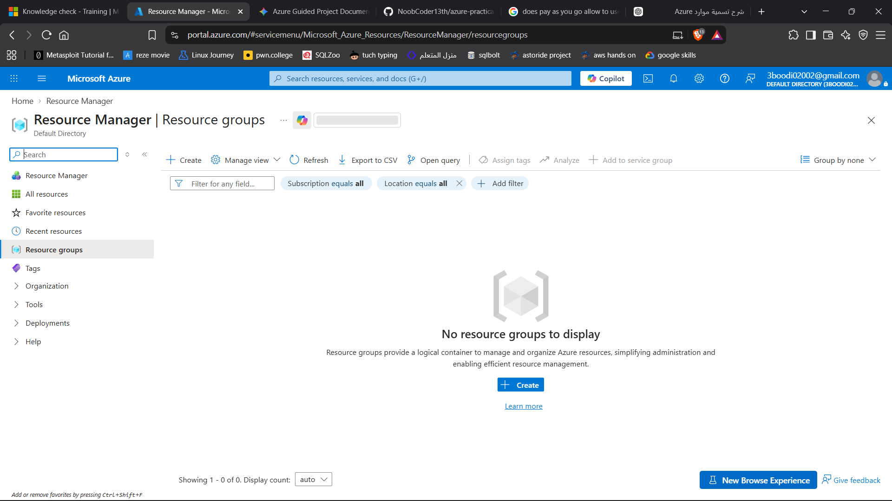

# Project: Manage Azure Resources with Cloud Shell and the Azure CLI

## Executive Summary
This project introduces **Azure Cloud Shell** and the **Azure CLI** as powerful command-line tools for provisioning, managing, and governing Azure resources. By leveraging a browser-based Bash terminal, administrators can execute scripts, apply tags, query complex JSON responses using JMESPath, and orchestrate rapid infrastructure lifecycles without relying on portal clicks.

---

## 1. Architecture & Core Concepts
* **Azure Cloud Shell:** An interactive, browser-accessible, authenticated terminal pre-installed with the Azure CLI and essential administration tools.
* **Azure CLI (`az`):** A command-line utility for managing Azure resources across services using structured parameters (`-n` name, `-g` resource group, `-l` location).
* **JMESPath Querying:** A built-in JSON query language utilized via the `--query` flag to filter, extract, and reshape CLI output without requiring external text-processing utilities.
* **Infrastructure Lifecycle Management:** Command-line orchestration spanning initial environment validation, resource provisioning, metadata tagging, and automated teardown.

---

## 2. Implementation Workflow

### Phase 1: Cloud Shell Environment & Discovery
1. **Launch Cloud Shell:** Initialize the browser-based terminal environment in Bash mode and validate active subscription contexts.
   * *Screenshot References:* , 
2. **Explore CLI Help Systems:** Discover commands, parameters, and services using root help menus (`az --help`, `az group --help`, `az storage account --help`) and list available regions (`az account list-locations`).

### Phase 2: Provisioning Resources via CLI
1. **Create Resource Group:** Provision a dedicated resource group (`rg-gp-cli`) from the terminal.
   * *Screenshot Reference:* 
2. **Provision Storage Accounts:** Use structured commands to deploy multiple storage accounts (`stcliaa1`, `stcliaa2`) specifying unique names, locations, and target resource groups.
   * *Screenshot References:* , 

### Phase 3: Tagging, Querying, & Portal Validation
1. **Apply Tags:** Update resource group properties from the CLI to attach metadata tags (e.g., `dep=it-ops`, `env=test`).
2. **Query with JMESPath:** Extract specific data fields and filter command output dynamically using the built-in `--query` parameter.
   * *Screenshot Reference:* 
3. **Portal Cross-Verification:** Inspect the Azure Portal to confirm that CLI-driven deployments align seamlessly with graphical views.
   * *Screenshot References:* , 

---

## 3. Validation & Teardown
* **CLI-Driven Decommissioning:** Delete the entire resource group and all child assets with a single command (`az group delete -n rg-gp-cli --yes`) to bypass manual confirmation prompts and avoid lingering cloud costs.
  * *Screenshot References:*  

---

## 4. Key Takeaways & Learnings
* **Speed and Efficiency:** The Azure CLI drastically accelerates deployment velocity, allowing complex multi-resource operations to be executed in seconds.
* **Embedded Querying Capabilities:** JMESPath integration eliminates the need for third-party filtering tools (like `jq`), streamlining JSON output manipulation directly inside terminal scripts.
* **Safe Automation:** Flags like `--yes` enable seamless script automation while explicit scope targeting ensures precise resource cleanup.