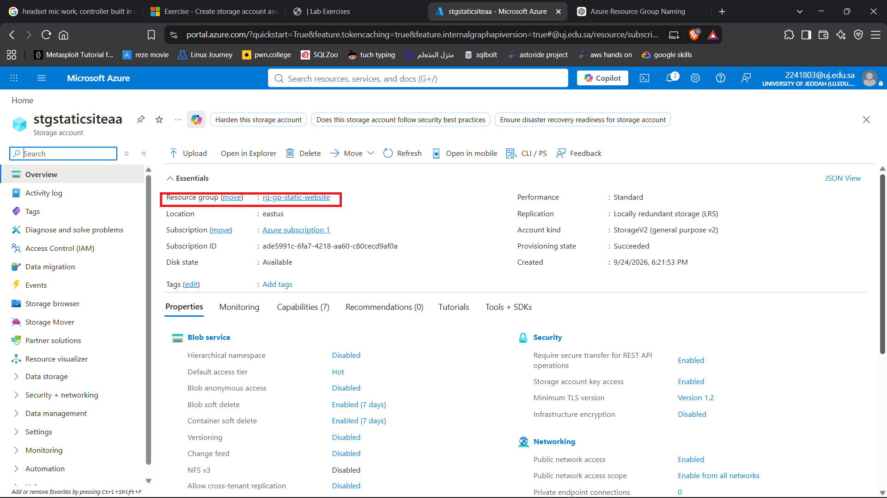
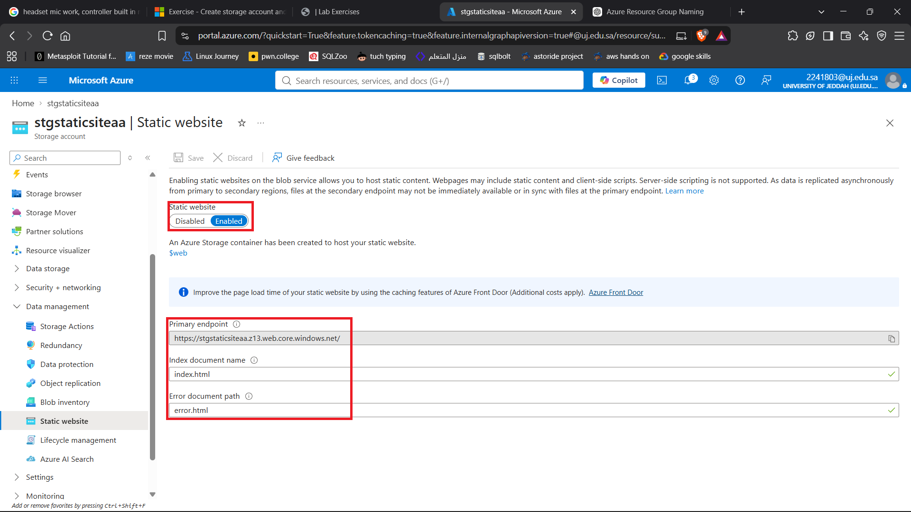
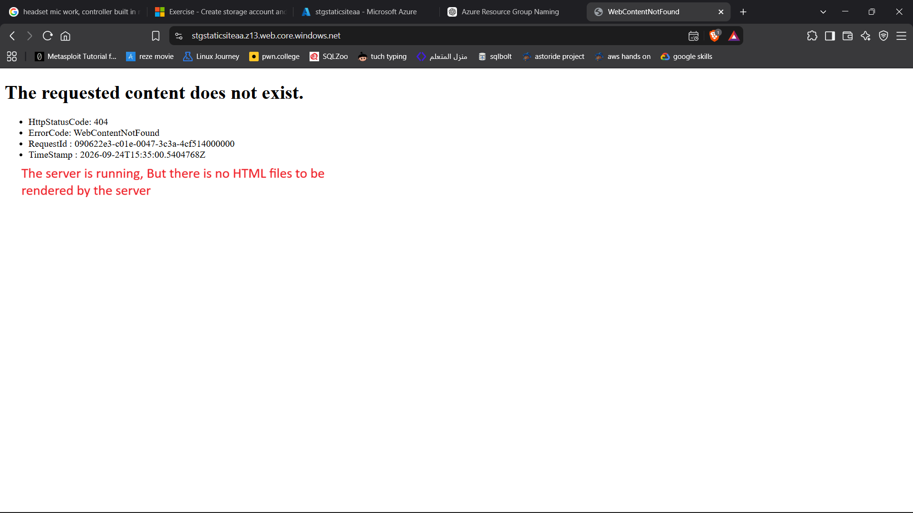
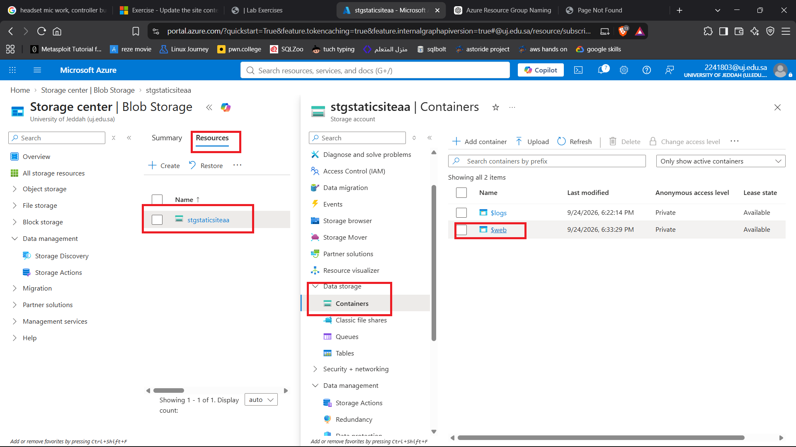
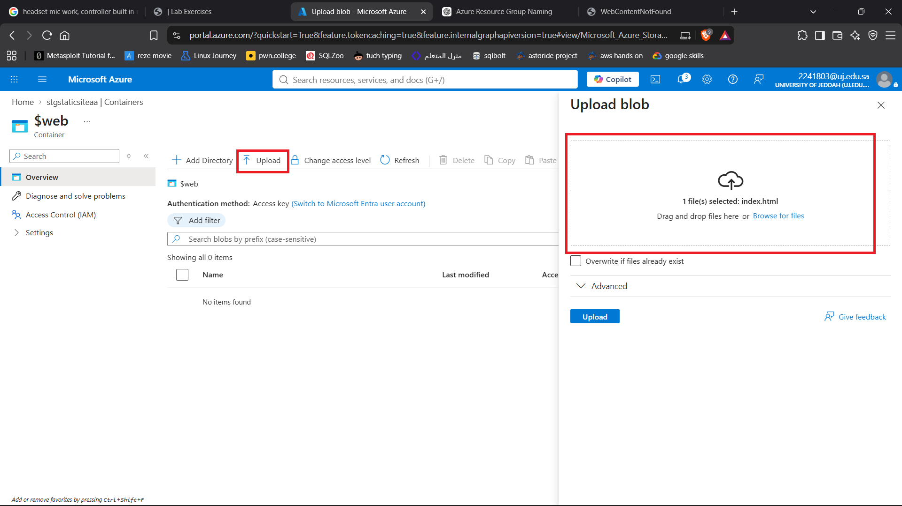
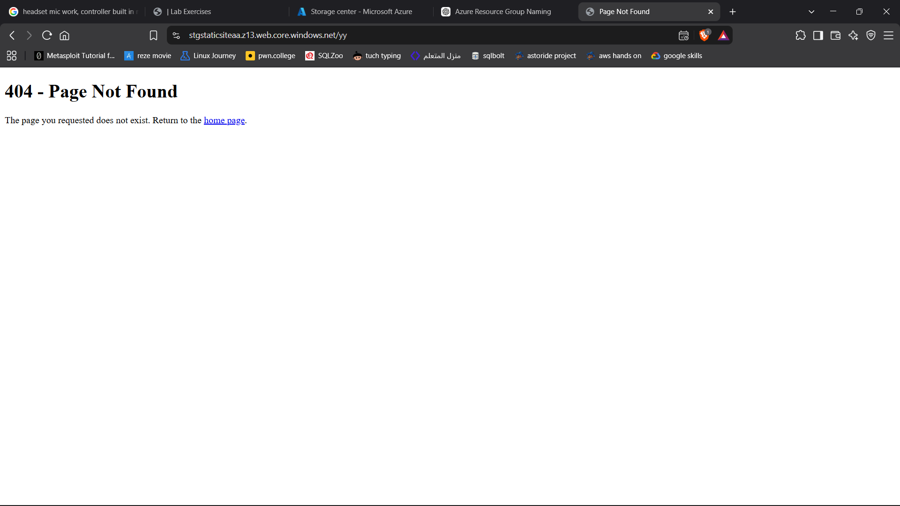
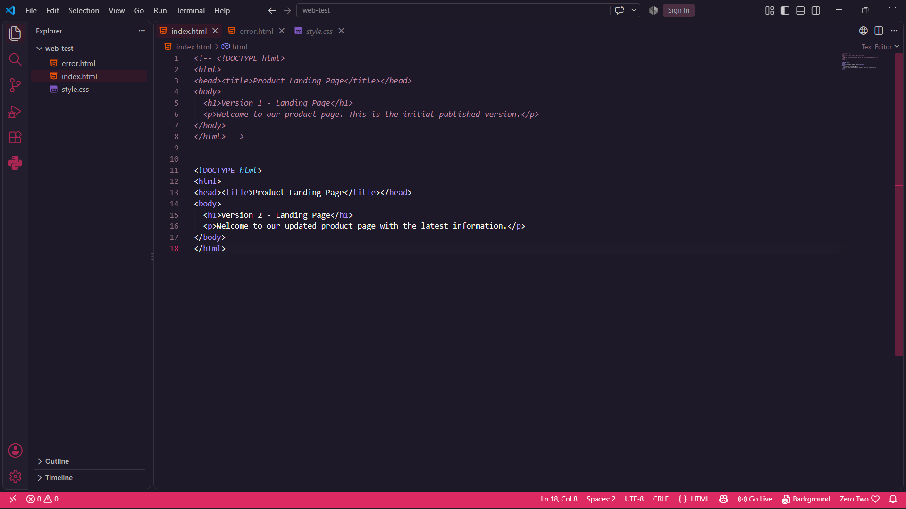
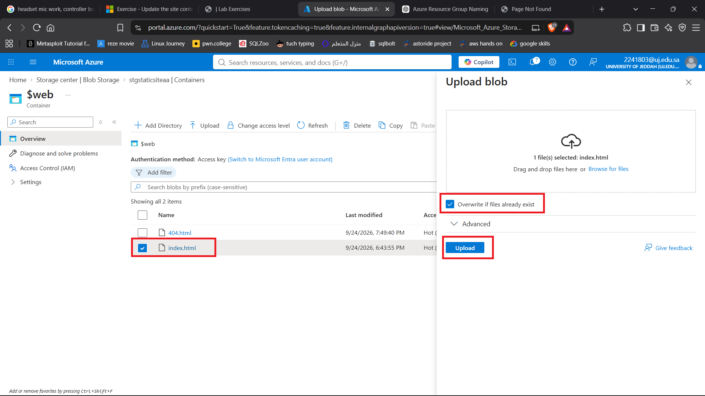
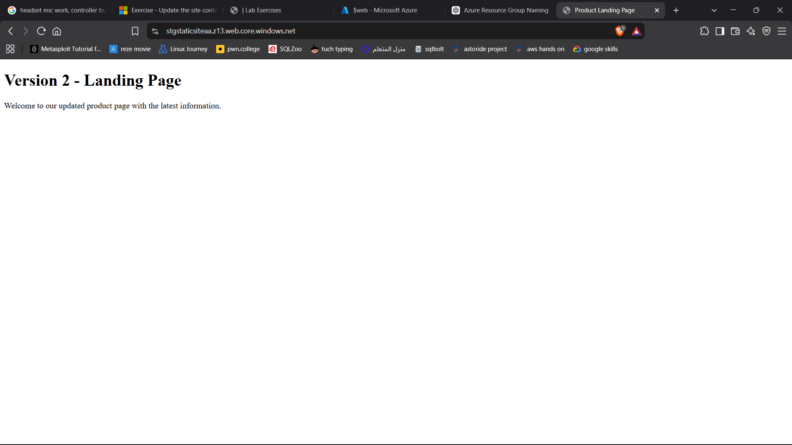

# Creating Web Hosting Using Azure Blob Storage

## Overview

This project demonstrates how to deploy a static HTML website using **Microsoft Azure Blob Storage**.

The process covers creating the required Azure resources, enabling static website hosting, uploading HTML files, updating the website, verifying the changes, and finally cleaning up the deployed resources.

## What This Project Covers

* Creating an Azure Resource Group
* Creating an Azure Storage Account
* Enabling static website hosting
* Understanding the automatically created `$web` container
* Uploading static HTML files
* Configuring the index and error documents
* Updating the hosted website
* Verifying the deployed website
* Cleaning up Azure resources by deleting the Resource Group

---

# Deployment Process

## Step 1: Create the Resource Group and Storage Account

The first step is to create an Azure Resource Group and a Storage Account. The Storage Account is created inside the Resource Group so that both resources can be managed together.

*Figure 1: The Resource Group and Storage Account have been successfully created.*

---

## Step 2: Enable Static Website Hosting

After creating the Storage Account, navigate to:

**Data storage → Static website**

Enable static website hosting.

When enabling the feature, specify the names of the files that will be used as the **index document** and **error document**.

Once enabled, Azure provides a public URL that can be used to access the website.

*Figure 2: The public URL generated for the static website.*

---

## Step 3: Verify the Website

The generated URL can now be accessed publicly.

At this stage, the website displays an error page because the configured HTML files have not yet been uploaded.

*Figure 3: The website URL is accessible, but the configured page has not yet been uploaded.*

---

## Step 4: Locate the `$web` Container

When static website hosting is enabled, Azure automatically creates a container named `$web`.

This container is used to store the files that make up the static website.

Navigate to:

**Storage Account → Data storage → Containers → `$web`**

*Figure 4: The automatically created `$web` container.*

---

## Step 5: Upload the HTML File

Open the `$web` container and select **Upload**.

Upload the HTML file that will be used as the website's index page.

Make sure the filename matches the **index document name** configured when static website hosting was enabled.

*Figure 5: Uploading the HTML file to the `$web` container.*

---

## Step 6: Verify the Uploaded HTML

After uploading the HTML file, open the public website URL again.

The uploaded HTML page should now be displayed instead of the previous error page.

*Figure 6: The uploaded HTML page is now accessible through the public URL.*

---

## Step 7: Verify the Error Document

The error page can also be tested by accessing a URL that does not exist.

The configured error document should be displayed.

If the expected error page does not appear, verify that the **error document path configured in the static website settings matches the actual filename of the uploaded error HTML file**.

*Figure 7: Verifying the configured error document.*

---

# Updating the Website

## Step 8: Update the HTML File Locally

The HTML file can be modified locally before uploading the updated version to Azure.

For this example, the local HTML file was updated with new content.

*Figure 8: Updating the HTML file locally.*

---

## Step 9: Open the `$web` Container

After modifying the file locally, return to the Azure Storage Account and navigate to:

**Data storage → Containers → `$web`**

*Figure 9: Opening the `$web` container to update the website files.*

---

## Step 10: Upload the Updated HTML File

Select **Upload** and upload the newly updated `index.html`.

Because a file with the same name already exists, enable the **overwrite** option before uploading.

*Figure 10: Uploading the updated HTML file and enabling overwrite.*

---

## Step 11: Verify the Updated Website

After uploading the new version, the file is updated in the `$web` container.

The public website can then be refreshed to verify that the new content is being served.

*Figure 11: The updated HTML page being served by Azure.*

---

# Cleaning Up the Resources

## Step 12: Delete the Resource Group

After completing the deployment and verification, the resources can be removed.

The Resource Group was deleted to clean up the resources created during this exercise.

> **Note:** The deletion process itself was not captured in a screenshot.

Deleting the Resource Group also deletes the resources contained within it, including the Storage Account used for this exercise.

---

## Step 13: Verify the Website Is No Longer Available

After deleting the Resource Group, the website URL should no longer be accessible.

*Figure 12: The website is no longer accessible after the resources were deleted.*

As an additional verification step, searching for the Resource Group in Azure confirms that it no longer exists.

---

# Lessons Learned
This exercise demonstrated the basic process of hosting a static website using Azure Blob Storage.

The overall process is:

1. Create a **Resource Group**.
2. Create a **Storage Account** inside the Resource Group.
3. Enable **static website hosting** on the Storage Account.
4. Azure automatically creates a **`$web` container**.
5. Configure the **index document** and **error document** paths.
6. Upload the corresponding HTML files to the `$web` container.
7. Access the generated public URL to verify the website.
8. Upload updated files and use **overwrite** when replacing existing files.
9. Delete the Resource Group when the exercise is complete to remove the resources created for the lab.

## Key Azure Concepts

### Resource Groups

A Resource Group is a logical container for Azure resources. Placing related resources in the same Resource Group makes them easier to manage and allows the entire set of resources to be removed together when the project is finished.

### Storage Account

An Azure Storage Account provides access to Azure Storage services. In this exercise, Blob Storage is used to store the static website files.

### `$web` Container

The `$web` container is automatically created when static website hosting is enabled. It stores the files that are served by the static website endpoint.

### Static Website Hosting

Azure Storage can serve static HTML, CSS, JavaScript, images, and other static files through a public website endpoint.

### Resource Cleanup

Deleting the Resource Group removes the resources contained within it. This provides a simple way to clean up resources created specifically for a lab and avoid leaving unnecessary resources behind.

