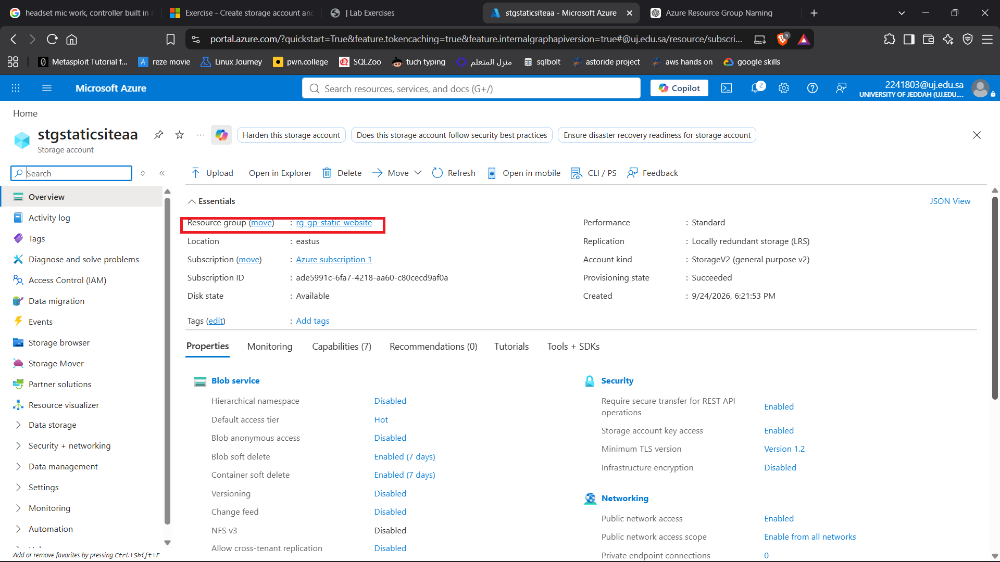
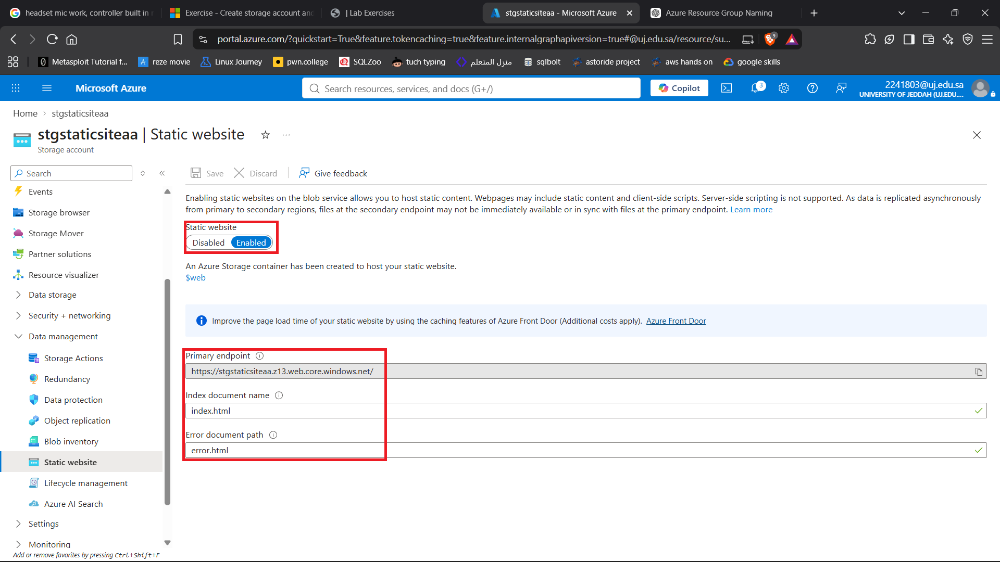
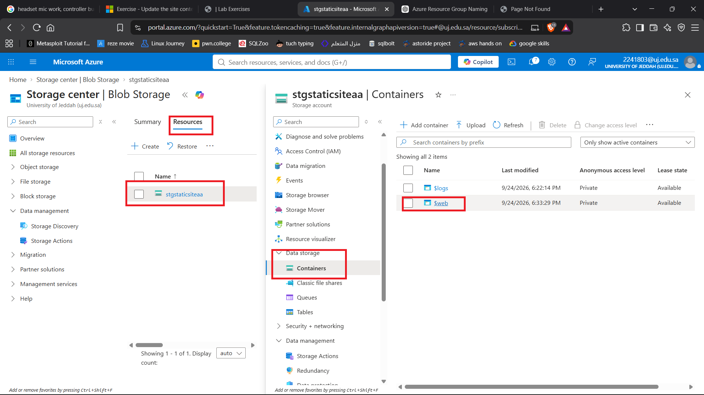
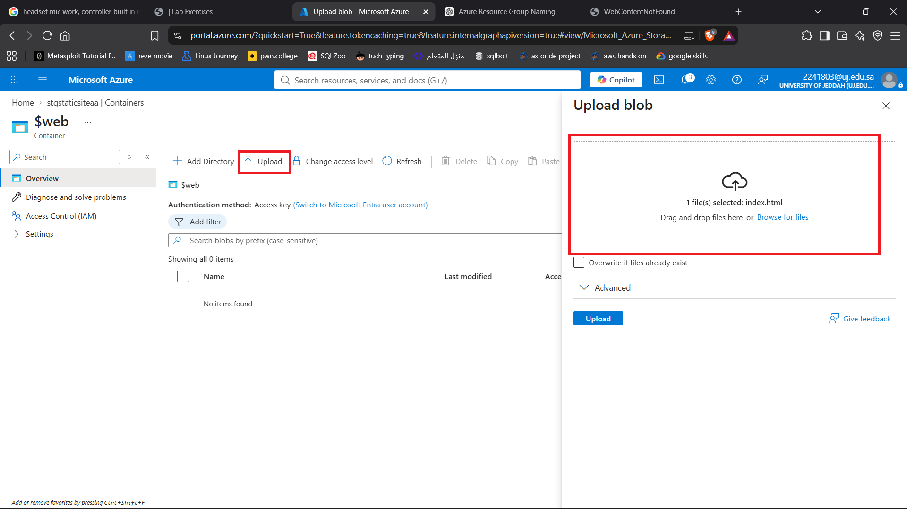
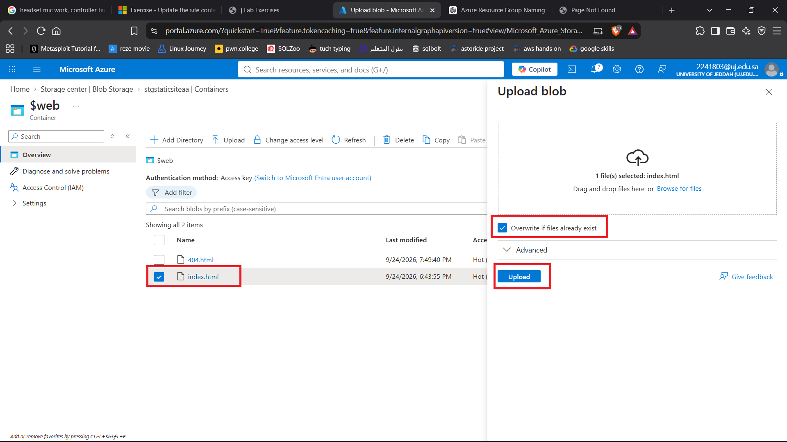

# Project: Static Website Hosting with Azure Blob Storage

## Executive Summary
This project demonstrates how to deploy, manage, and tear down a static website (HTML, CSS, JS) using **Microsoft Azure Blob Storage**. By leveraging Azure's built-in static website endpoint, we eliminate the need for traditional web servers while benefiting from cloud-scale storage and simple resource lifecycle management.

---

## 1. Architecture & Core Concepts
* **Resource Group:** Acts as a logical container to manage, monitor, and delete all related Azure resources as a single unit.
* **Storage Account:** Provides secure, scalable cloud storage services; in this project, it powers Azure Blob Storage.
* **The `$web` Container:** Automatically provisioned by Azure upon enabling static hosting. This special container holds all publicly served root directory files.
* **Static Website Endpoint:** A unique public URL generated by Azure to serve files directly from the `$web` container.

---

## 2. Implementation Workflow

### Phase 1: Provisioning Infrastructure
1. **Create Resource Group:** Establish a dedicated logical container for the project resources.
2. **Create Storage Account:** Deploy a general-purpose storage account within the target Resource Group.
   * *Screenshot Reference:* 

### Phase 2: Configuring Static Hosting
1. Navigate to **Data storage → Static website** inside the Storage Account settings.
2. Enable static website hosting and define the primary document mappings:
   * **Index document name:** `index.html`
   * **Error document path:** `404.html` (or your custom error file)
3. Copy the generated **Primary Endpoint URL**.
   * *Screenshot Reference:* 

### Phase 3: Content Deployment & Management
1. **Locate the `$web` Container:** Navigate to **Data storage → Containers** to find the automatically generated `$web` container.
   * *Screenshot Reference:* 
2. **Upload Files:** Upload your local `index.html` and error pages directly into the `$web` container, ensuring exact filename matches with your configuration.
   * *Screenshot Reference:* 
3. **Updates & Overwrites:** Modify files locally, return to the `$web` container, upload the new version, and enable the **overwrite existing blob** option.
   * *Screenshot Reference:* 

---

## 3. Validation & Testing
* **Initial State Check:** Accessing the public URL prior to uploading files yields a default error page, confirming endpoint accessibility. *(Ref: Figure 3)*
* **Successful Deployment Check:** Refreshing the URL post-upload serves the custom `index.html` content. *(Ref: Figure 6)*
* **Error Routing Check:** Navigating to a non-existent path correctly triggers the defined custom error document. *(Ref: Figure 7)*

---

## 4. Resource Cleanup
To prevent ongoing cloud costs, delete the parent Resource Group, which cascades deletion to all child assets (Storage Account, containers, and blobs).
* *Verification:* Confirming that the public endpoint URL returns an error and the Resource Group no longer appears in the Azure Portal. *(Ref: Figure 12)*

---

## 5. Key Takeaways & Learnings
* **Serverless Simplicity:** Azure Blob Storage static web hosting removes virtual machine management overhead, patching, and OS maintenance for static content.
* **Container Automation:** The system automatically abstracts backend infrastructure by generating and managing the `$web` container upon feature activation.
* **Lifecycle Governance:** Grouping resources under a shared Resource Group guarantees clean, safe, and complete decommissioning of test environments.
