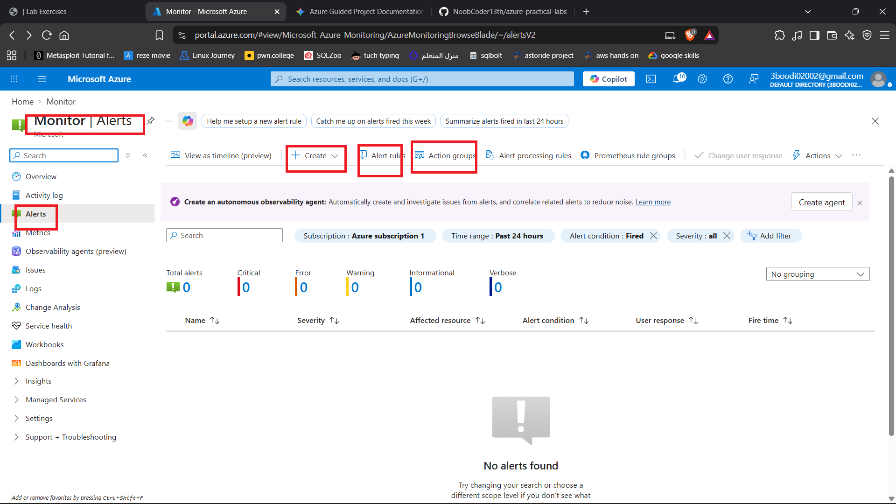
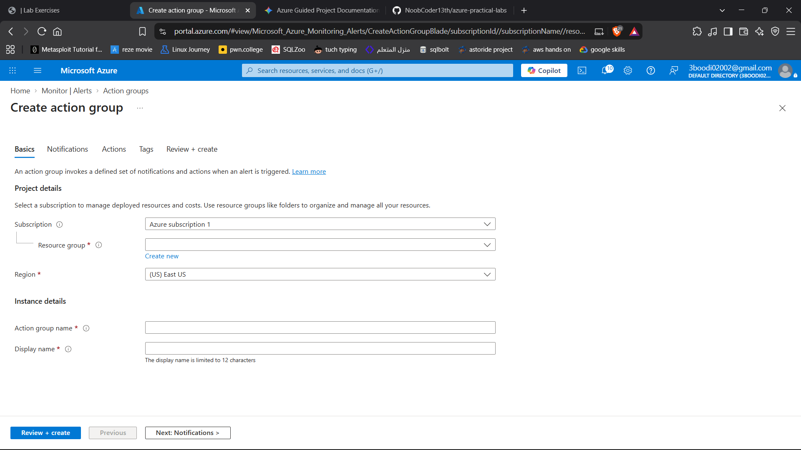
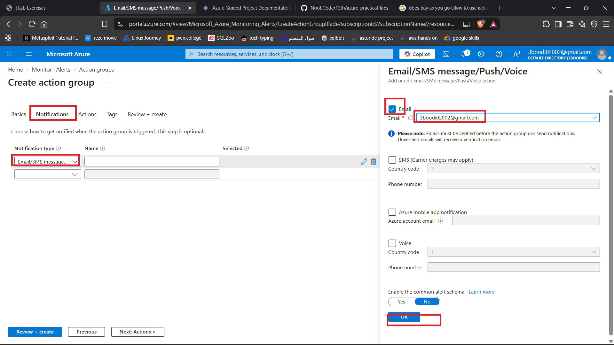
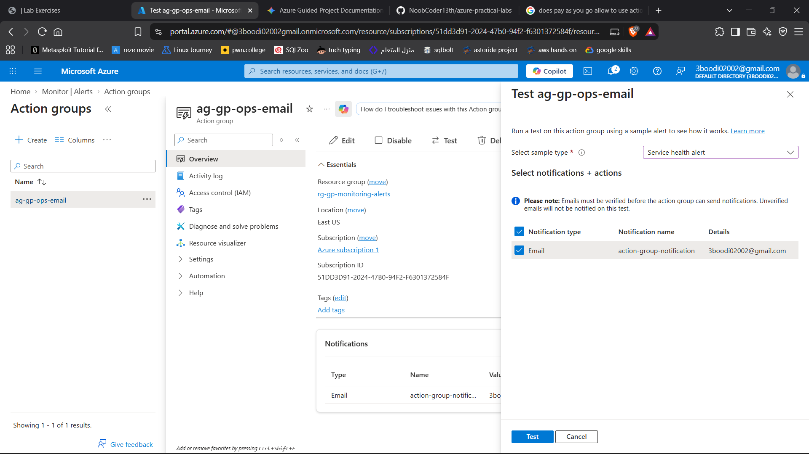
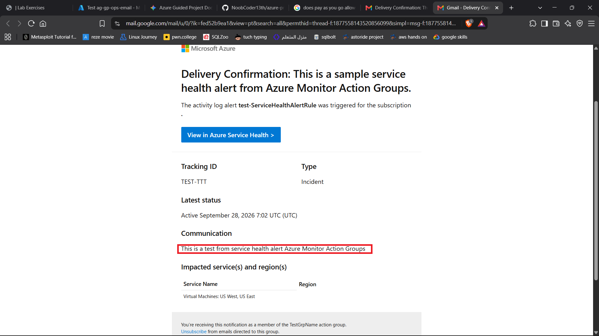
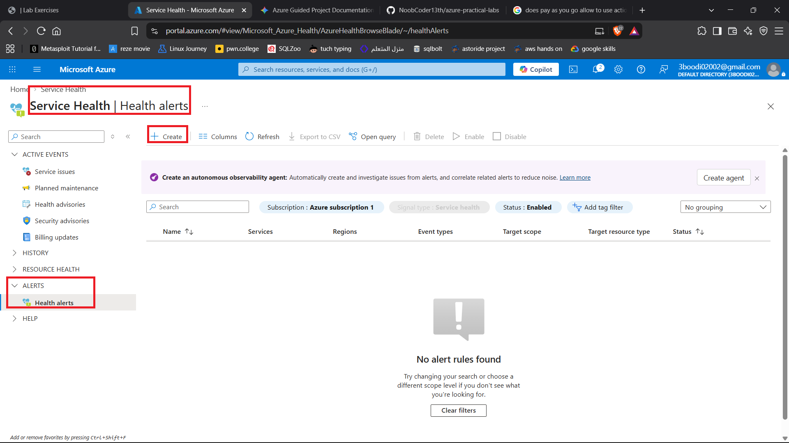
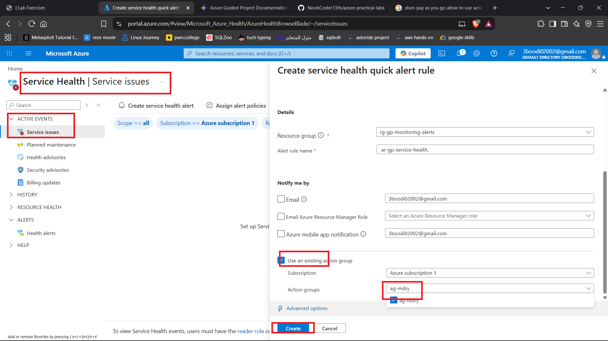
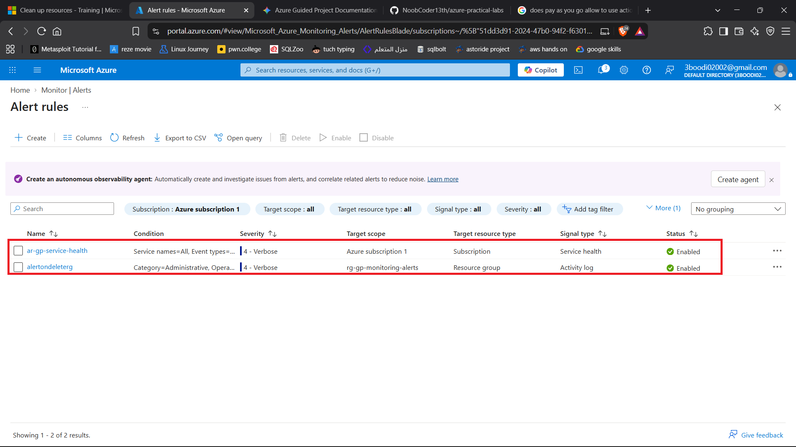

# Project: Monitor Azure with Service Health and Activity Log Alerts

## Executive Summary
This project focuses on implementing comprehensive cloud monitoring and alerting guardrails using **Azure Service Health**, **Activity Log Alerts**, and **Action Groups**. By establishing proactive notification channels for platform incidents, planned maintenance, and critical infrastructure changes like resource deletions, operations teams gain real-time visibility into cloud environments.

---

## 1. Architecture & Core Concepts
* **Action Groups:** Reusable notification channels that define who gets contacted and how (e.g., via email) when an alert fires.
* **Service Health Alerts:** Monitors Azure platform-level health, reporting regional incidents, security advisories, and planned maintenance impacting services.
* **Activity Log Alerts:** Tracks management-plane operations (such as resource modifications or deletions) across subscriptions or resource groups.
* **Resource Provider Registration (`Microsoft.Insights`):** Core Azure subscription registration required to enable telemetry collection, monitoring services, and alert rule evaluations.

---

## 2. Implementation Workflow

### Phase 1: Environment Setup & Action Groups
1. **Register Provider:** Navigate to the target subscription settings, locate **Resource providers**, and register `Microsoft.Insights` to enable monitoring tools.
2. **Create Action Group:** Provision a shared action group to configure operational email notifications and verify delivery via a test message.
   * *Screenshot References:* , , , , 

### Phase 2: Service Health Alert Configuration
1. **Navigate to Service Health:** Open Azure Service Health from the Monitor portal to filter platform events by subscription and region.
   * *Screenshot Reference:* 
2. **Create Service Health Rule:** Configure a platform alert rule targeting service incidents and planned maintenance linked to the operations action group.
   * *Screenshot Reference:* 

### Phase 3: Activity Log Deletion Alert Configuration
1. **Configure Scope & Signal:** In Azure Monitor, create a new alert rule scoped to the monitoring resource group targeting the `Delete resource group` or resource deletion activity log signal.
2. **Attach Action Group & Set Severity:** Bind the operations action group, assign severity (`Sev 2 - Warning`), name the rule (`ar-gp-activity-delete`), and save.
   * *Screenshot Reference:* 

---

## 3. Validation & Review
* **Rule Inventory Check:** Inspect **Monitor > Alerts > Alert rules** to confirm that both the Service Health and Activity Log alert rules are successfully created and enabled. *(Ref: Figure: rules-created-200.png)*

---

## 4. Resource Cleanup
To decommission the monitoring environment cleanly:
1. Delete the individual alert rules (`ar-gp-activity-delete` and service health rules).
2. Delete the shared action group.
3. Delete the primary monitoring resource group to remove any residual linked metadata.

---

## 5. Key Takeaways & Learnings
* **Proactive Operational Visibility:** Combining Service Health alerts with Activity Log tracking ensures teams are notified instantly of both cloud provider outages and internal destructive changes.
* **Reusable Notification Frameworks:** Action groups decouple notification configurations from alert rules, allowing single-point management for team email lists and webhooks.
* **Subscription-Level Telemetry:** Core monitoring features require explicit resource provider registration (`Microsoft.Insights`) to authorize telemetry processing across scopes.