# Project: Managing Azure Resources with Tags and Locks

## Executive Summary
This project covers core Azure governance practices: utilizing **Resource Tags** for metadata-driven organization, filtering, and cost tracking, and **Management Locks** to safeguard critical cloud infrastructure against accidental modifications or deletions.

---

## 1. Architecture & Core Concepts
* **Azure Resource Tags:** Metadata key-value pairs used to categorize, filter, and track assets across environments, departments, or cost centers.
* **Management Locks:** Preventive governance controls applied to subscriptions, resource groups, or individual resources to restrict operations.
* **Delete Lock:** Blocks deletion operations while permitting configuration updates and modifications.
* **Read-only Lock:** Enforces strict protection by blocking both configuration changes and deletions.

---

## 2. Implementation Workflow

### Phase 1: Resource Tagging & Deployment
1. **Navigate and Create Tags:** Access the global Tags section in the Azure portal to create custom key-value pairs representing parameters like environment, department, or owner.
   * *Screenshot Reference:* 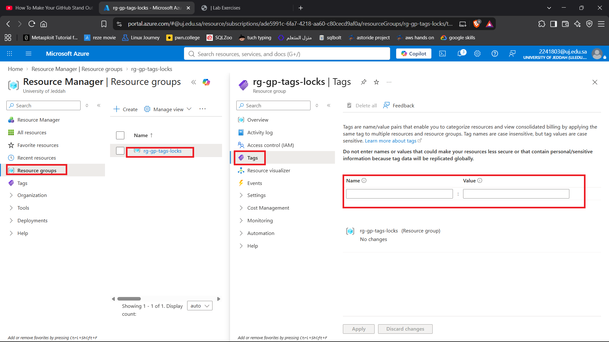 | 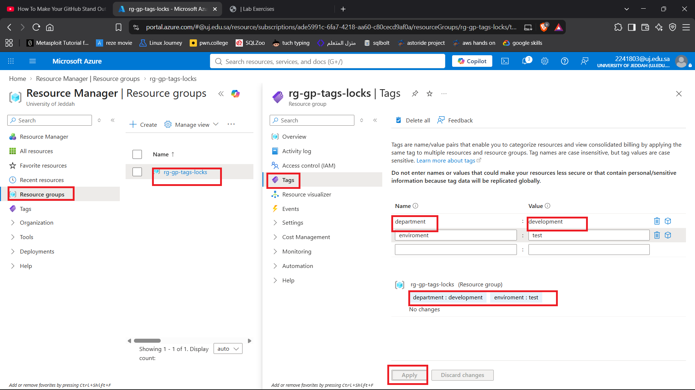
2. **Apply Tags During Provisioning:** Assign metadata tags directly during resource creation (e.g., prior to deploying a Storage Account) to ensure immediate organization.
   * *Screenshot Reference:* 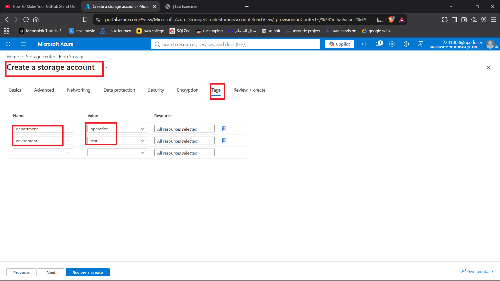
3. **Verify Tags:** Inspect the deployed resource to confirm that metadata properties are correctly attached.
   * *Screenshot Reference:* 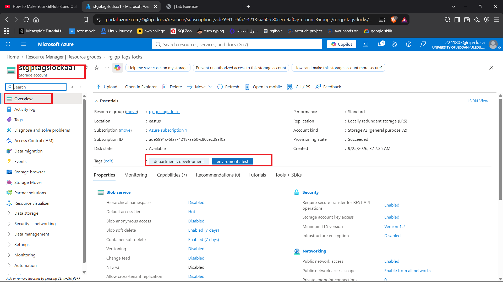

### Phase 2: Filtering and Auditing Resources
1. **Filter by Tags:** Use the Azure portal's filtering engine to isolate specific groups of assets based on their assigned metadata keys and values.
   * *Screenshot Reference:* 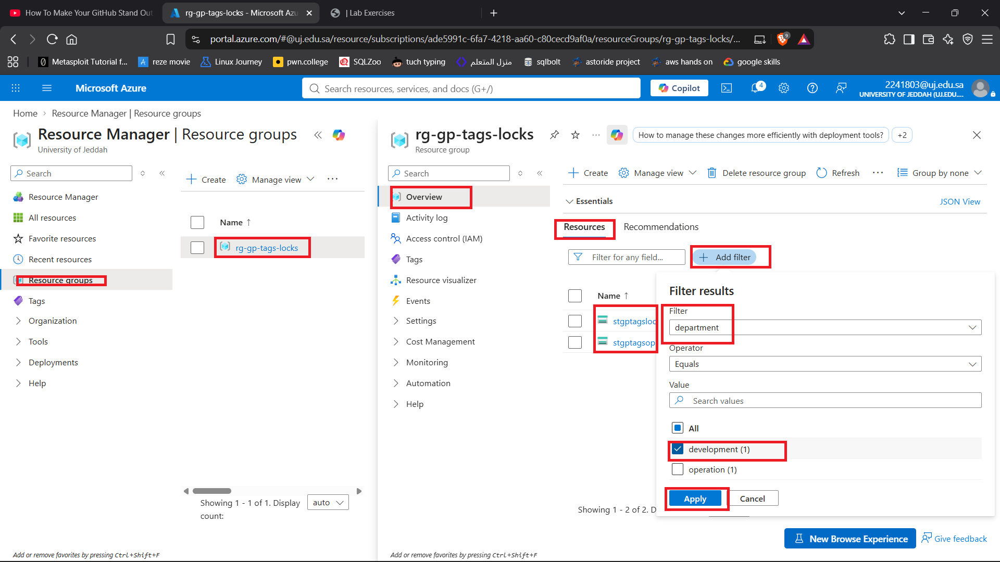
2. **Review Filter Results:** Verify that the filtered view correctly isolates the targeted resources and allows for quick metadata audits.
   * *Screenshot Reference:* 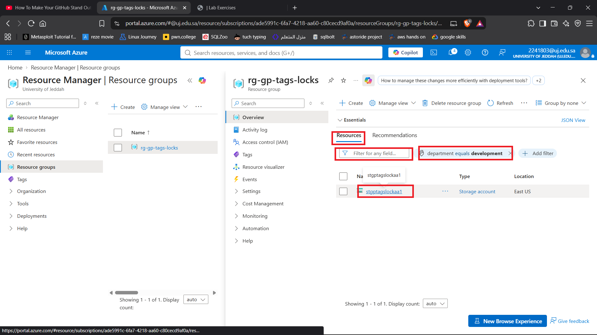 | 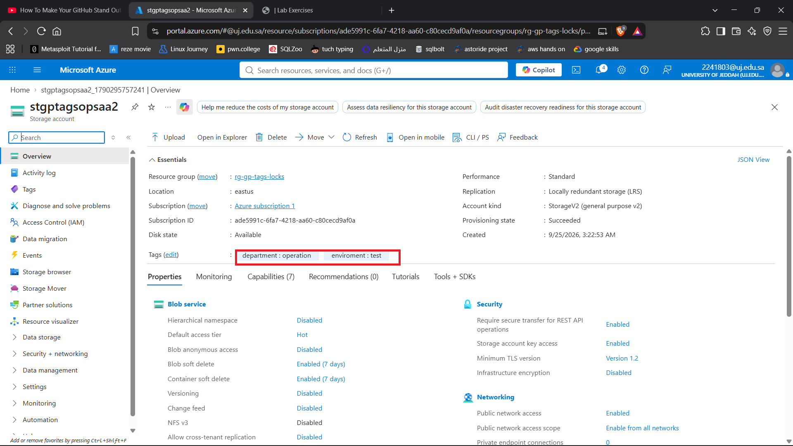

### Phase 3: Configuring Management Locks
1. **Navigate to Locks:** Locate the locks management blade within the target resource or resource group.
   * *Screenshot Reference:* 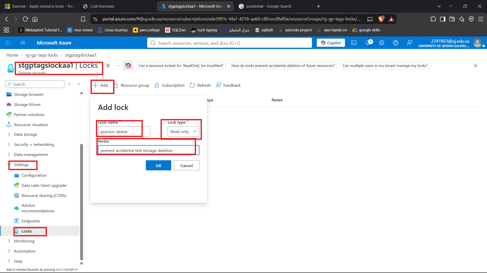
2. **Apply Locks Across Scopes:** Configure different lock tiers depending on operational safety needs (e.g., a Read-only lock on a Resource Group and a Delete lock on an individual Storage Account).
   * *Screenshot Reference:* 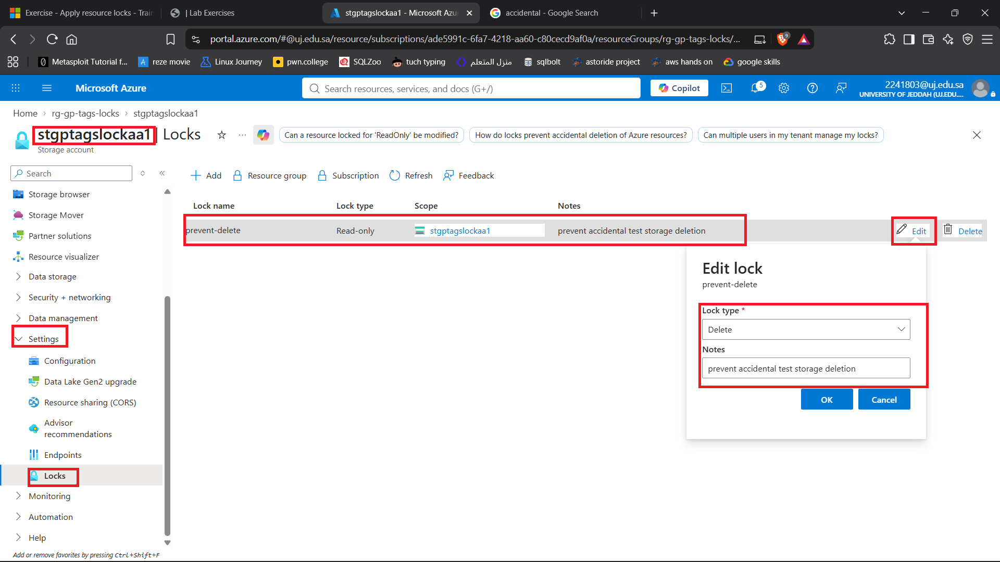 | 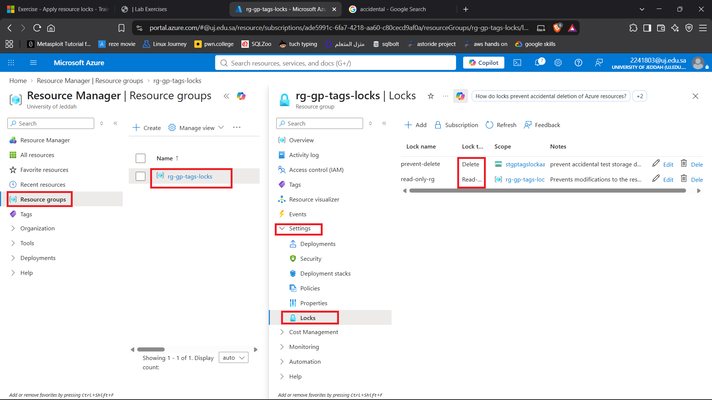

---

## 3. Validation & Testing

### Lock Behavior Matrix
| Lock Type | Modify Resource | Delete Resource |
| :--- | :---: | :---: |
| **Read-only** | ❌ Blocked | ❌ Blocked |
| **Delete** | ✅ Allowed | ❌ Blocked |
| **No Lock** | ✅ Allowed | ✅ Allowed |

* **Read-only Lock Test:** Attempting to update or modify configurations on a Read-only locked resource triggers a rejection error. 
  * *Screenshot Reference:* 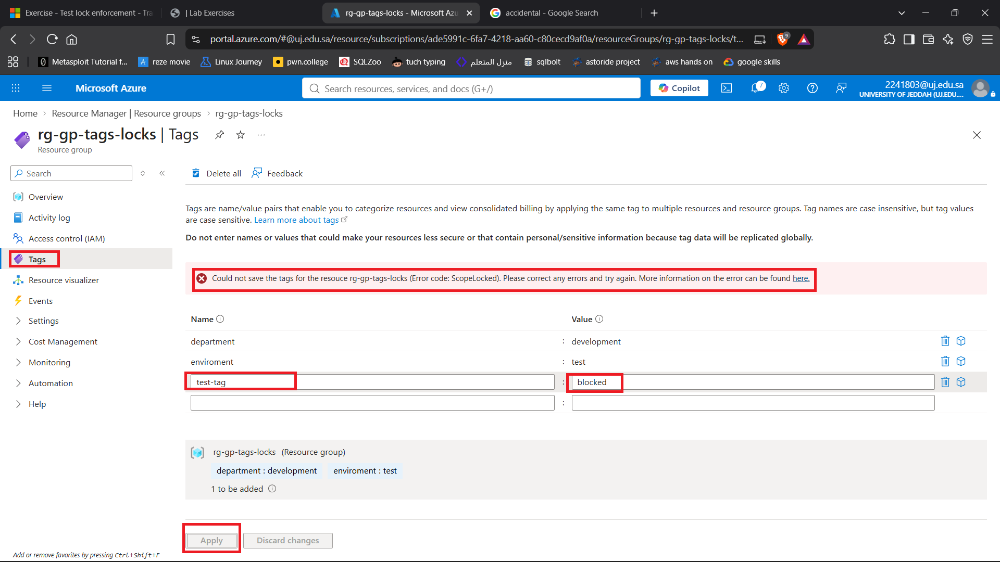
* **Delete Lock Test:** Attempting to delete a Delete-locked resource is blocked, while configuration edits remain fully permitted. 
  * *Screenshot Reference:* 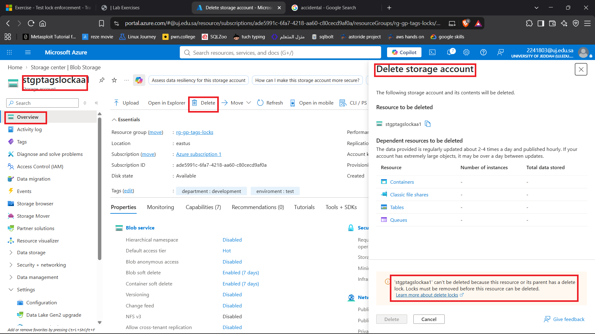

---

## 4. Resource Cleanup & Remediation
To modify or deprovision protected resources, explicit administrative overrides must be applied by clearing the locks first:
1. Navigate to the resource or scope **Locks** section.
2. Select and delete the active lock preventing the action.
3. Proceed with standard configuration updates or resource deletions.
   * *Screenshot Reference:* 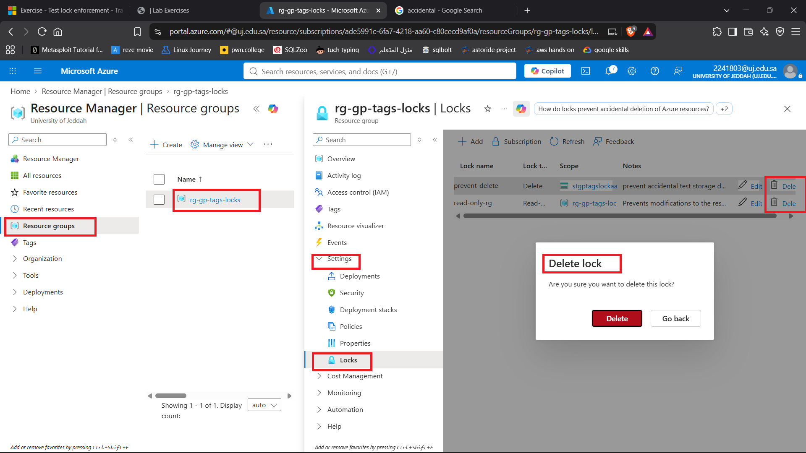 | 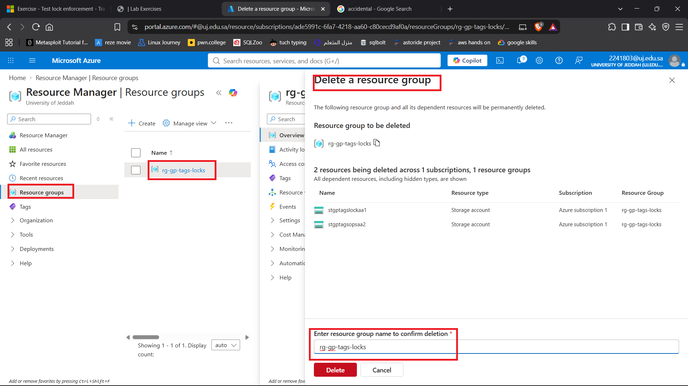

---

## 5. Key Takeaways & Learnings
* **Metadata-Driven Governance:** Tags form the foundation for resource organization, environment separation, and granular cloud cost tracking.
* **Hierarchical Protection:** Management locks inherit downwards across scopes, providing a powerful safety net against human error in team environments.
* **Explicit Lifecycle Requirements:** Azure treats locks as strict administrative boundaries; routine maintenance or teardown operations require explicit manual clearance of active locks beforehand.