# Azure Resource Tags and Locks

## Overview

This lab focuses on managing Azure resources using **resource tags** and **management locks**.

The goal is to understand how tags can be used to organize and filter Azure resources, particularly when managing resources for cost tracking and separation, and how locks can prevent accidental changes or deletion.

The lab also demonstrates the difference between **Read-only** and **Delete** locks and how to remove a lock when a protected resource needs to be deleted or modified.

## What This Lab Covers

* Adding tags to Azure resources
* Adding tags during resource creation
* Filtering resources by tags
* Using tags for resource organization and cost management
* Applying **Read-only** locks
* Applying **Delete** locks
* Understanding the difference between Read-only and Delete locks
* Testing how locks affect resource operations
* Removing locks to allow resources to be modified or deleted

---

# Resource Tags

## 1. Navigate to Tags

Navigate to the **Tags** section in the Azure portal.

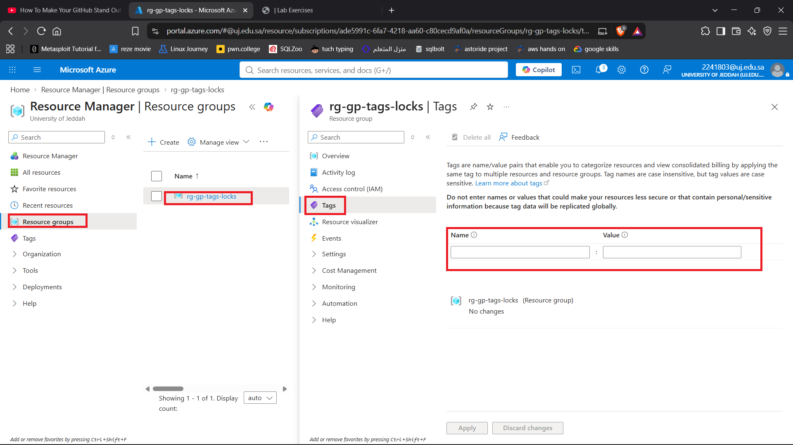

*Figure 1: Navigating to the Tags section.*

## 2. Create and Apply Tags

Create a tag by providing a **name** and **value**, then apply it to the appropriate resource.

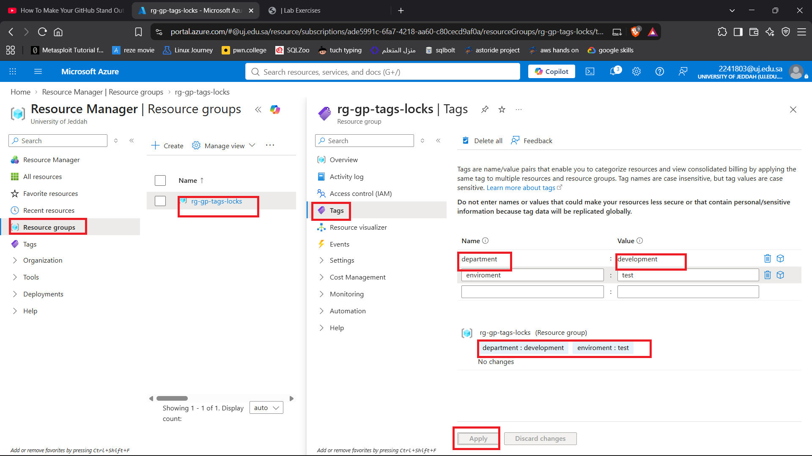

*Figure 2: Creating and applying a resource tag.*

Tags can be used to identify resources based on information such as:

* Environment
* Department
* Project
* Owner
* Cost center

## 3. Add Tags During Resource Creation

Tags can also be added directly while creating a resource.

For this example, a new Storage Account was created and tags were assigned before deployment.

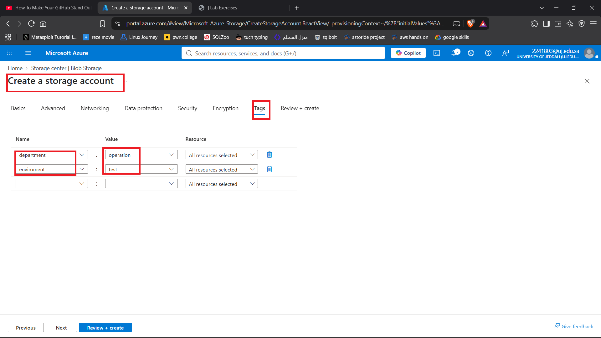

*Figure 3: Adding tags to a Storage Account before deployment.*

This provides another way to organize resources without having to create the resource first and tag it afterward.

## 4. Verify the Tags

After deployment, open the Storage Account and verify that the assigned tags are present.

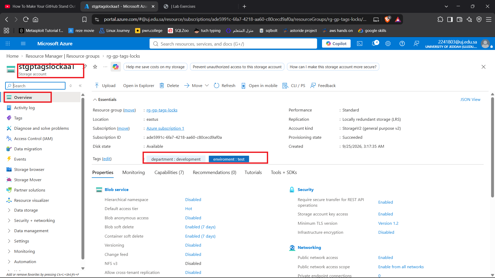

*Figure 4: Verifying the tags assigned to the Storage Account.*

## 5. Filter Resources by Tags

Azure allows resources to be filtered based on their assigned tags.

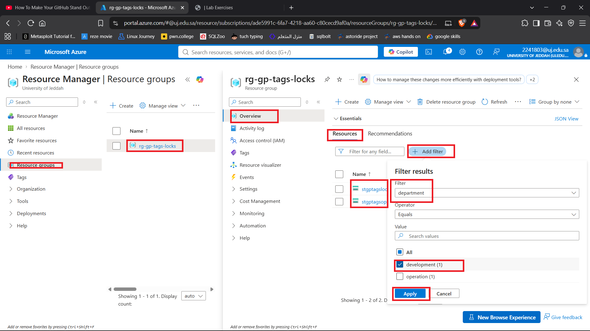

*Figure 5: Filtering resources using tags.*

Filtering resources by tags can be useful when managing a large Azure environment.

For example, resources can be separated by:

* Project
* Environment
* Team
* Department
* Cost center

This can also make it easier to identify groups of resources when reviewing or managing cloud costs.

## 6. Review Filtered Resources

After applying the tag filter, Azure displays the resources matching the selected tag.

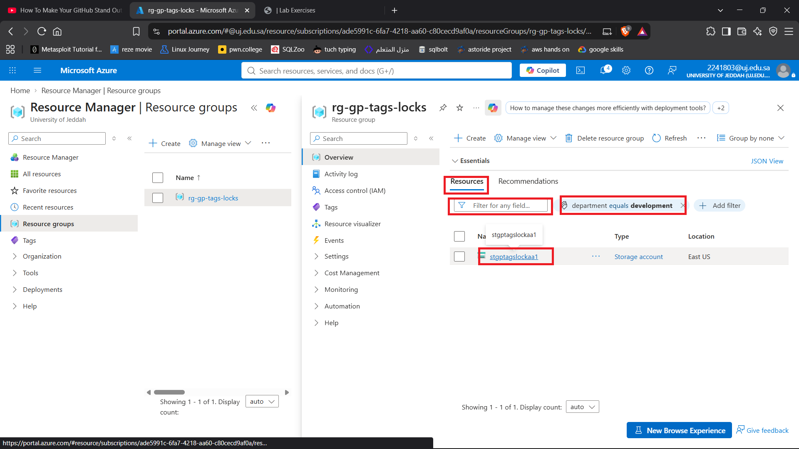

*Figure 6: Resources matching the selected tag.*

Selecting a resource allows its assigned tags to be reviewed.

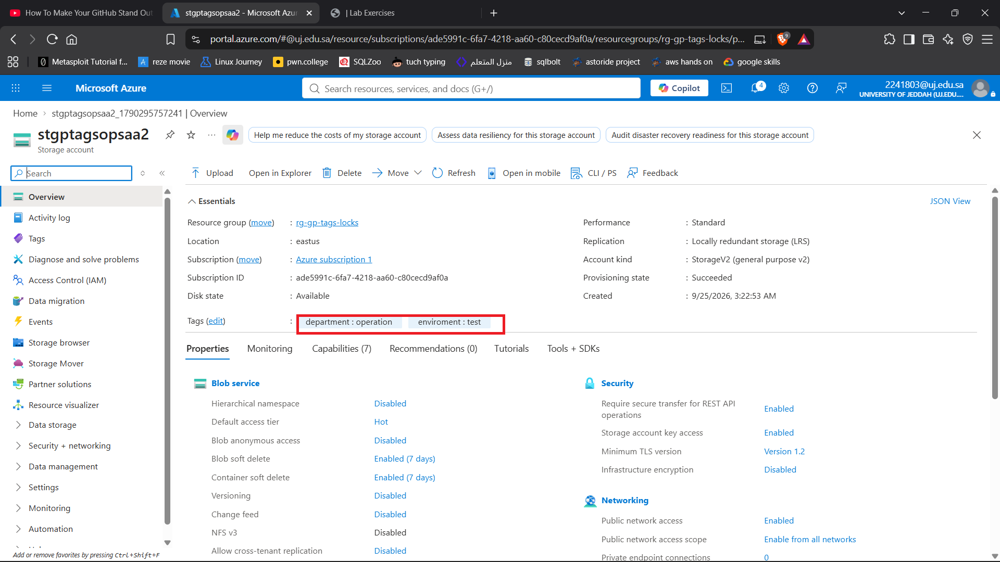

*Figure 7: Viewing the tags assigned to the selected resource.*

---

# Resource Locks

## 7. Navigate to Locks

Azure provides **management locks** that can be applied to resources to prevent accidental changes or deletion.

Navigate to the **Locks** section of the resource.

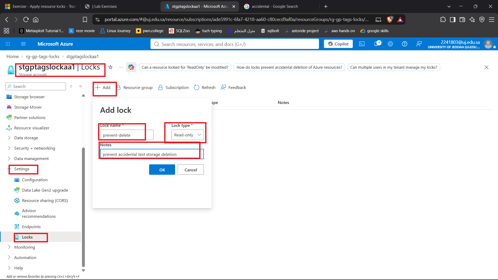

*Figure 8: Navigating to the resource Locks section.*

## 8. Apply a Delete Lock

Create a new lock and select **Delete** as the lock type.

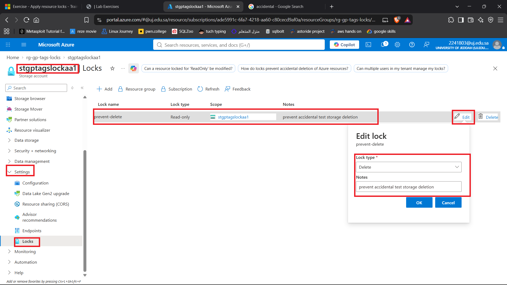

*Figure 9: Applying a Delete lock to a resource.*

A Delete lock prevents the protected resource from being deleted while the lock is active.

## 9. Apply Locks to Resources

Locks can be applied at different scopes.

In this lab, locks were applied to both:

* A Resource Group
* A Storage Account

The Resource Group was given a **Read-only** lock, while the Storage Account was given a **Delete** lock.

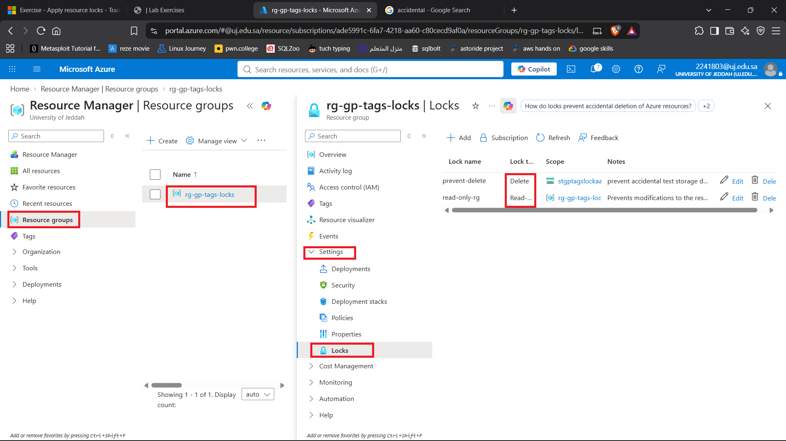

*Figure 10: Read-only and Delete locks applied to the resources.*

---

# Testing Resource Locks

## 10. Test the Read-only Lock

Attempting to modify a resource protected by a **Read-only** lock is blocked.

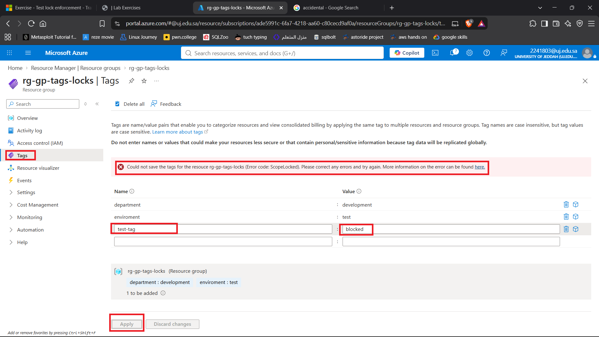

*Figure 11: Attempting to modify a resource protected by a Read-only lock.*

A Read-only lock is more restrictive than a Delete lock because it prevents changes to the resource as well as deletion.

## 11. Test the Delete Lock

Attempting to delete a resource protected by a **Delete** lock is blocked.

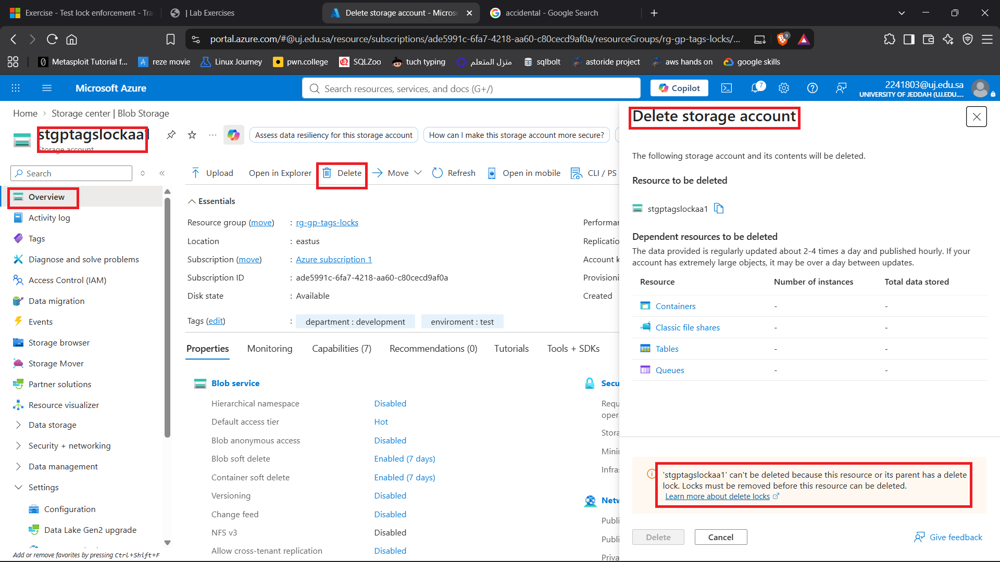

*Figure 12: Attempting to delete a resource protected by a Delete lock.*

The resource can still be modified, but it cannot be deleted while the Delete lock is active.

## 12. Remove the Lock

To modify or delete a protected resource, the applicable lock must first be removed.

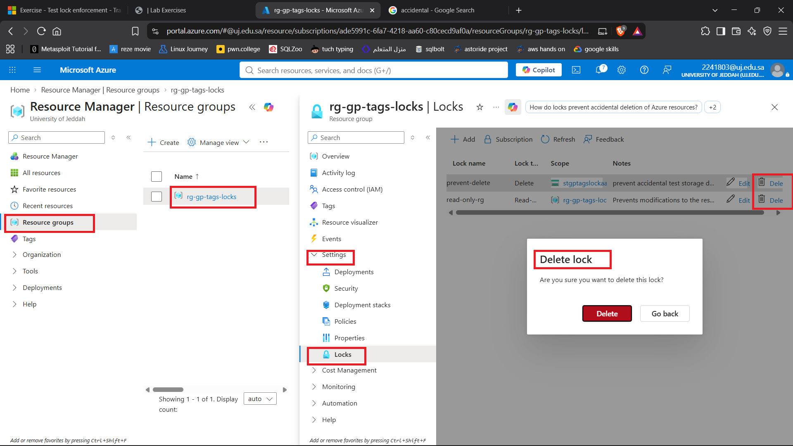

*Figure 13: Removing the resource lock.*

After removing the lock, the previously restricted operation becomes available again.

## 13. Verify Resource Deletion

Once the lock has been removed, the resource can be deleted normally.

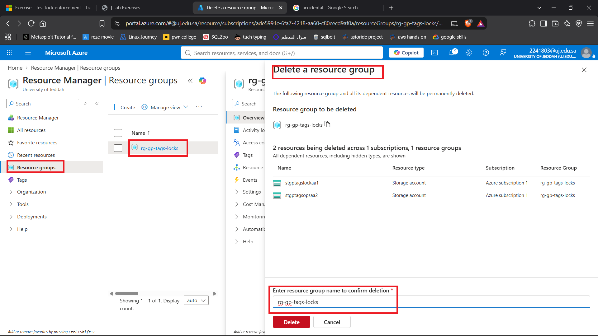

*Figure 14: Resource deletion is available after removing the lock.*

---

# Read-only vs Delete Lock

| Lock Type     | Modify Resource | Delete Resource |
| ------------- | --------------- | --------------- |
| **Read-only** | ❌ Not allowed   | ❌ Not allowed   |
| **Delete**    | ✅ Allowed       | ❌ Not allowed   |
| **No Lock**   | ✅ Allowed       | ✅ Allowed       |

The main difference is that a **Delete lock protects against deletion**, while a **Read-only lock prevents both modification and deletion**.

---

# How to Delete a Resource With a Lock

A resource protected by a lock cannot simply be deleted.

The general process is:

1. Open the protected resource or its applicable scope.
2. Navigate to **Locks**.
3. Identify the lock preventing the operation.
4. Delete the lock.
5. Return to the resource.
6. Perform the required modification or deletion.

For a Read-only lock, the lock must be removed before making changes to the protected resource.

For a Delete lock, the lock must be removed before deleting the resource.

---

# Lessons Learned

This lab demonstrated several important Azure resource-management concepts:

1. **Tags provide a way to organize resources** using key-value pairs.
2. **Tags can be added after resource creation or during deployment.**
3. **Resource filtering can be performed using tags**, making it easier to locate groups of resources.
4. Tags can support **cost organization and resource separation** in larger Azure environments.
5. **Delete locks prevent resources from being deleted** while still allowing modifications.
6. **Read-only locks prevent both modifications and deletion.**
7. **Locks must be removed before performing operations that they restrict.**
8. Locks can be applied at different scopes, including resource groups and individual resources.

# Key Concepts

* Azure Resource Tags
* Resource Organization
* Resource Filtering
* Cost Management
* Management Locks
* Read-only Lock
* Delete Lock
* Resource Groups
* Resource Protection
* Resource Deletion
