# Sharing Files Securely with Azure Blob Storage

This guided project demonstrates how to securely share files with an external partner using **Azure Blob Storage, stored access policies, Shared Access Signatures (SAS), and lifecycle management**.

The project uses a simulated finance-team scenario where a report needs to be shared with an external partner for a limited period without making the storage container publicly accessible.

## Exercises

* Exercise 1: Create Storage and Upload File
* Exercise 2: Create Access Policy and Generate SAS
* Exercise 3: Test Partner Access
* Exercise 4: Revoke Partner Access
* Exercise 5: Configure Lifecycle Management

---

# Exercise 1: Create Storage and Upload File

The first exercise prepares the storage environment used throughout the project.

### Tasks

* Prepare the Azure environment
* Create a resource group
* Create a storage account
* Create a private blob container
* Upload a sample report file

I first created the resource group and storage account as part of the environment setup.

I then navigated to **Data Storage** and created a private container for the partner file exchange.

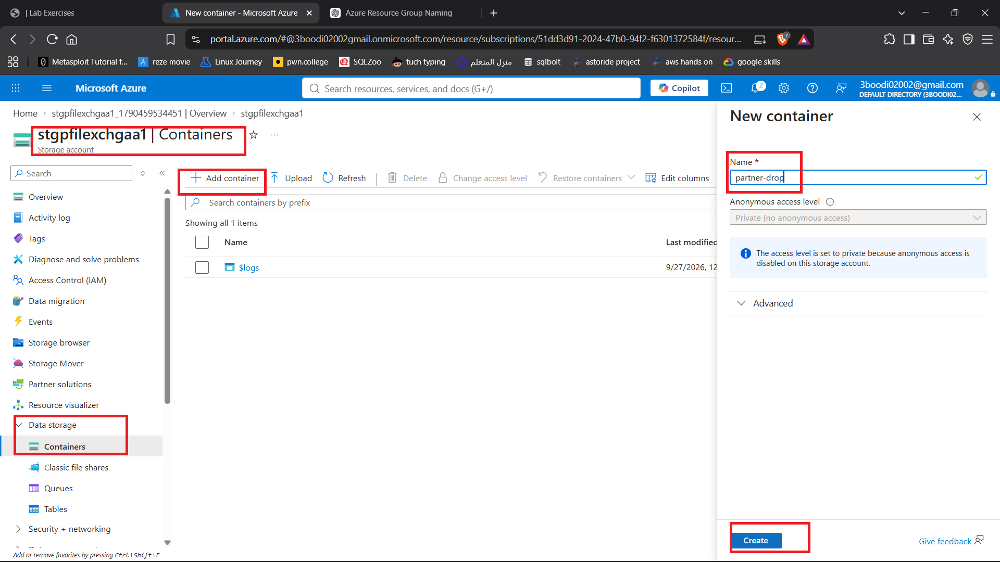

After creating the container, I uploaded the sample report file.

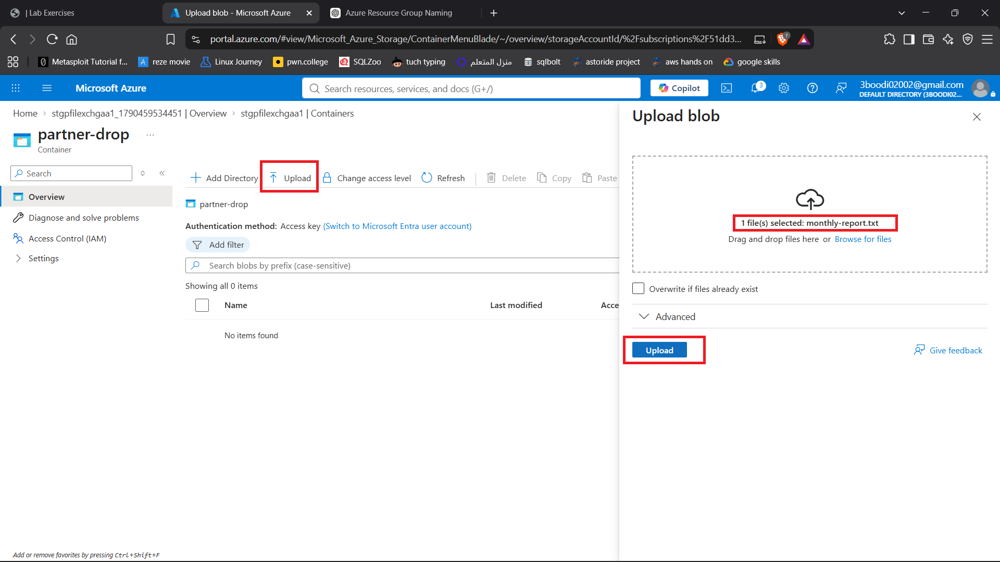

The uploaded file was then visible inside the container.

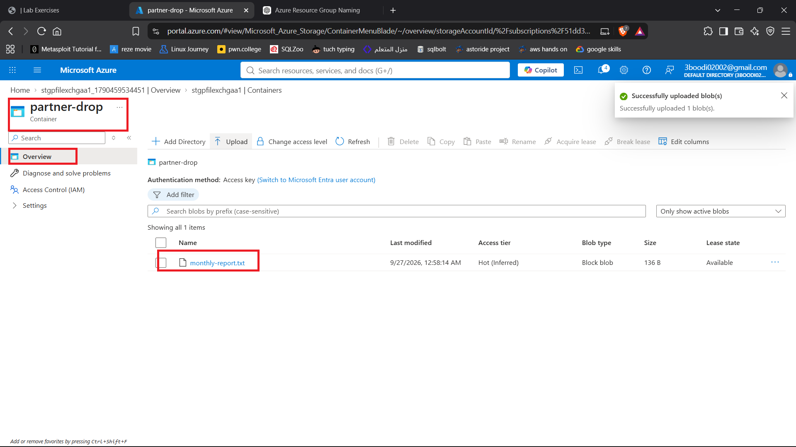

---

# Exercise 2: Create Access Policy and Generate SAS

The second exercise creates a **stored access policy** and uses it to generate a **Shared Access Signature (SAS)** for the report.

A stored access policy provides a centralized way to define the permissions and expiry associated with SAS access. This also allows access to be revoked later by deleting the policy.

### Tasks

* Create a stored access policy
* Configure its permissions and expiry
* Generate a SAS URL using the stored access policy

I created the stored access policy on the container.

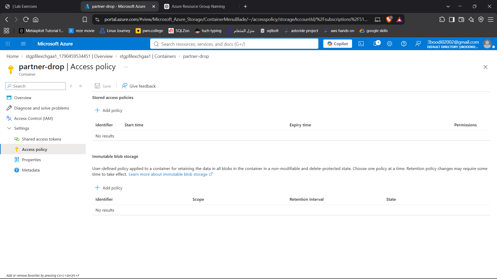

I then configured the policy.

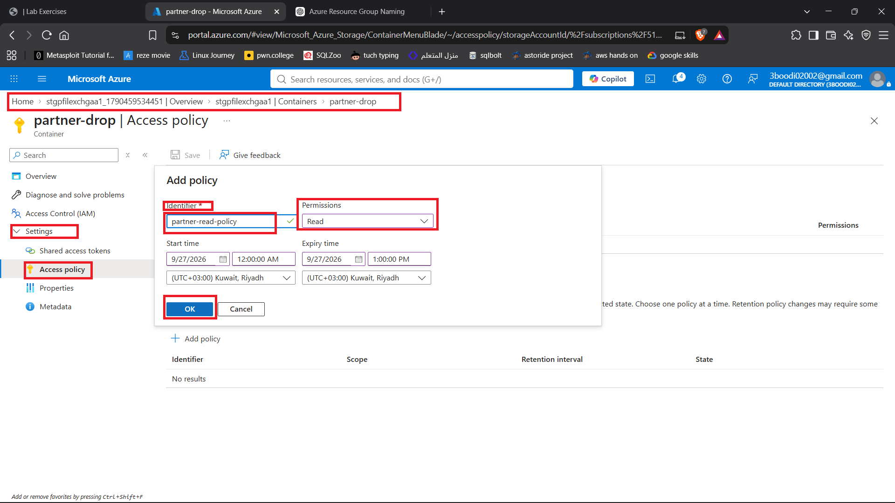

After creating the policy, I generated a SAS URL based on the stored access policy.

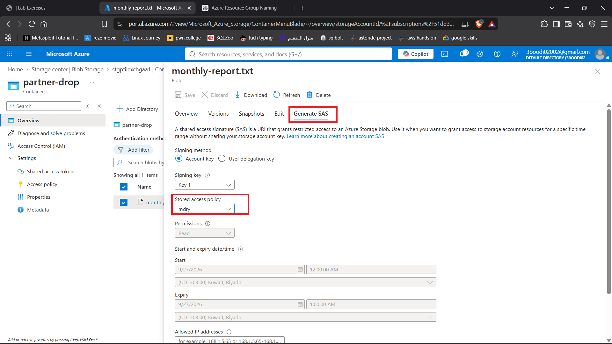

The generated SAS URL was saved temporarily for use in the following exercises.

> **Security note:** SAS URLs contain credentials that grant access to the resource. The actual SAS URL and token are intentionally not included in this documentation.

---

# Exercise 3: Test Partner Access

The third exercise tests the two sides of the access model.

First, I verified that the blob could not be accessed directly without a SAS token. I then tested the generated SAS URL to confirm that it provided access to the file.

### Tasks

* Verify direct access is blocked
* Test access using the SAS URL

I copied the direct blob URL without the SAS parameters and attempted to access the file.

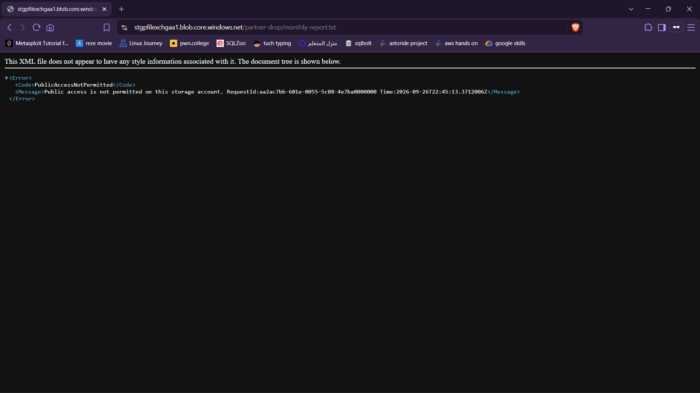

The request was denied.

I then opened the generated SAS URL.

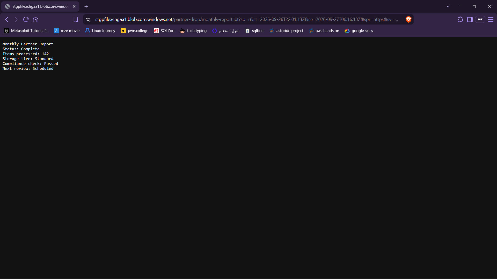

The file was accessible through the SAS URL even though I was not signed in and was using a private browser window.

This demonstrated that the SAS token provided access independently of an Azure account login while direct anonymous access to the blob remained blocked.

---

# Exercise 4: Revoke Partner Access

The fourth exercise demonstrates how access can be revoked before the SAS token reaches its expiration time.

The stored access policy acts as the central control point for the SAS token. Deleting the policy invalidates SAS tokens associated with that policy.

### Tasks
* Delete the stored access policy
* Verify SAS access has been revoked
* Confirm the file still exists

Before deleting the policy, I confirmed that the SAS URL still provided access.

I then deleted the stored access policy.

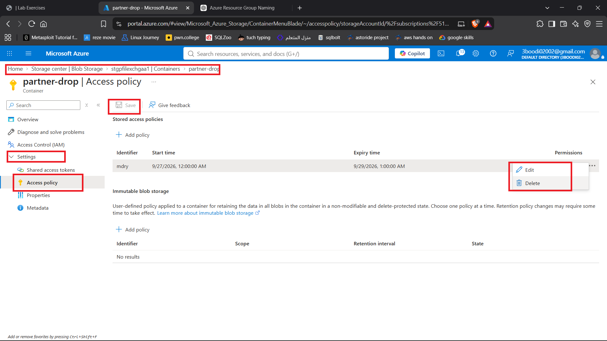

After deleting the policy, I checked the SAS URL again.

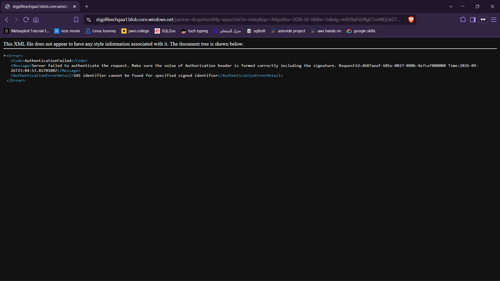

The SAS URL was no longer able to provide access, while the underlying blob remained stored in the container.

### Troubleshooting

During this exercise, I initially selected the wrong stored access policy while testing the revocation process. After deleting the policy, the SAS URL continued to work.

I investigated the behavior and found that the SAS token had been generated from a different policy than the one I deleted. I corrected the process by selecting the policy that was actually associated with the SAS token.

The screenshot shows the policy name as `mdry` because I corrected the configuration during troubleshooting rather than recreating the screenshot.

---

# Exercise 5: Configure Lifecycle Management

The final exercise configures automatic cleanup for files stored in the partner container.

Revoking SAS access prevents the partner from accessing the file, but it does not delete the file from storage. A lifecycle management rule can be used to automatically remove old files.

### Tasks

* Create a lifecycle management rule
* Configure automatic deletion
* Review the lifecycle rule configuration

I navigated to the storage account's lifecycle management settings.

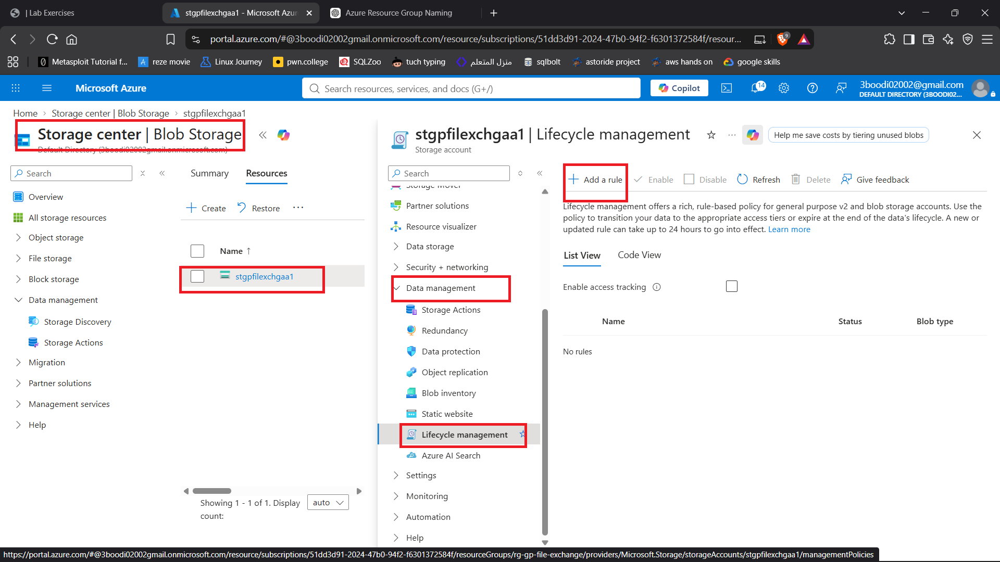

I configured the first part of the lifecycle management rule.

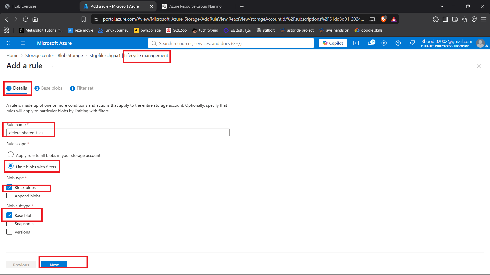

I continued configuring the rule and its conditions.

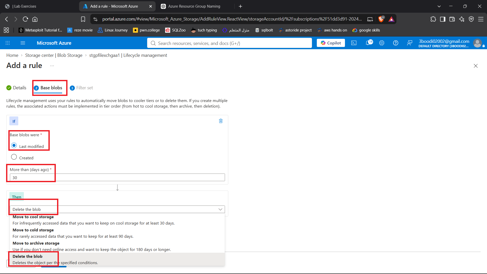

I completed the configuration for automatic cleanup.

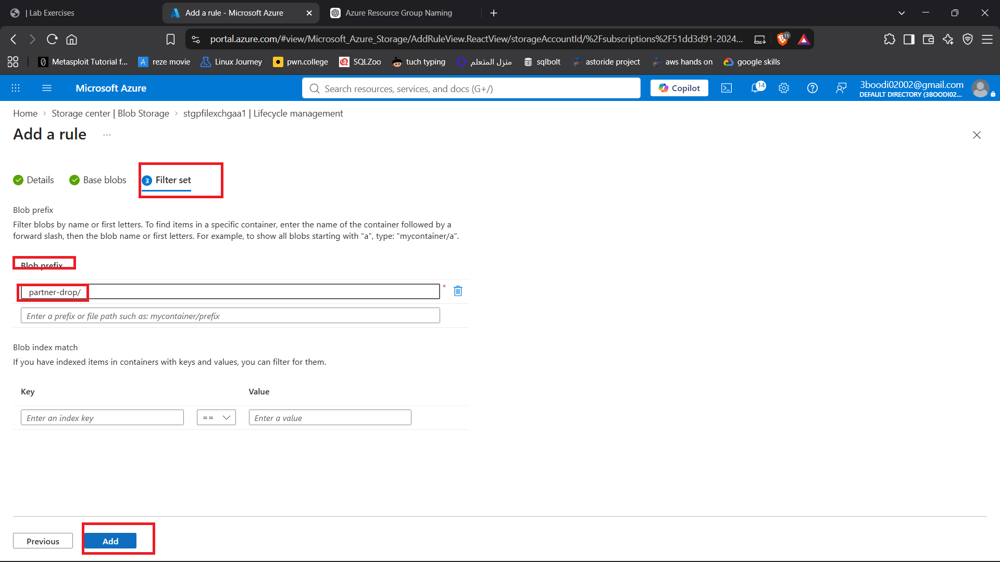
in the blob prefix, put the blob name you created with a `/`.

The rule was configured to automatically delete files in the partner container after **30 days**.

---

# What I Learned

Through this project, I worked with:

* **Azure Blob Storage** and private blob containers
* **Stored access policies** for centralized access control
* **Shared Access Signatures (SAS)** for temporary, scoped access to blobs
* The difference between **direct blob access and SAS-based access**
* How SAS access can work without an authenticated Azure account
* How deleting a stored access policy can **revoke associated SAS access**
* How access policies can be used as a central control point for SAS tokens
* **Azure Storage lifecycle management** for automatic blob cleanup
* Troubleshooting SAS access by tracing the relationship between a SAS token and its stored access policy
* The importance of keeping SAS URLs and other storage credentials out of documentation and source control
