# Project: Cost Management and Compliance with Azure Policy

## Executive Summary
This project focuses on implementing foundational cost guardrails and governance controls using **Resource Tags**, **Azure Budgets**, and **Azure Policy**. By establishing automated cost reporting metrics, spending thresholds, and region-restriction policies, organizations can prevent configuration drift and control cloud spending effectively.

---

## 1. Architecture & Core Concepts
* **Resource Tags:** Key-value pairs used to categorize and organize cloud assets for granular cost tracking, auditing, and reporting.
* **Azure Budgets:** Financial guardrails configured at specific scopes to monitor spending trajectories and trigger proactive email alerts at designated thresholds.
* **Azure Policy:** Governance mechanism that enforces rules and compliance standards automatically, blocking noncompliant resource provisioning before it occurs.
* **Region Compliance Control:** A policy enforcement mechanism that restricts resource creation to approved geographic locations to meet compliance or data residency mandates.

---

## 2. Implementation Workflow

### Phase 1: Cost-Tracking Tags
1. **Prepare Environment:** Create a dedicated Resource Group and a test Storage Account.
2. **Apply Tags:** Assign organizational metadata tags to both the resource group and the storage account:
   * `environment: pilot`
   * `owner: it-team`
   *(Note: Applied directly during or post-provisioning to establish baseline cost attribution.)*

### Phase 2: Budgets & Alert Configuration
1. **Navigate to Cost Management:** Open the Cost Management + Billing section to initiate budget creation.
   * *Screenshot Reference:* 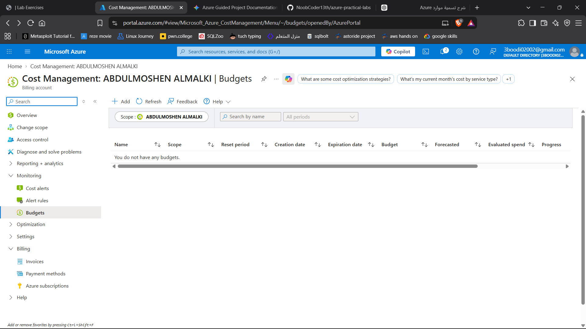
2. **Configure Budget Parameters:** Define spending limits, alert thresholds (e.g., 80% and 100%), and notification email targets.
   * *Screenshot References:* 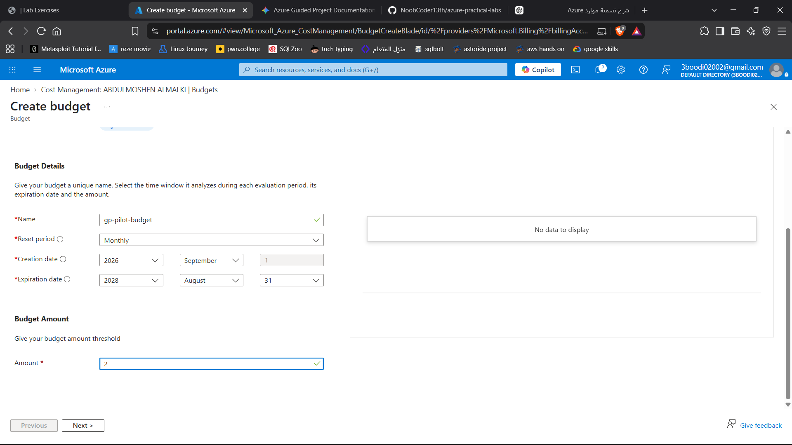, 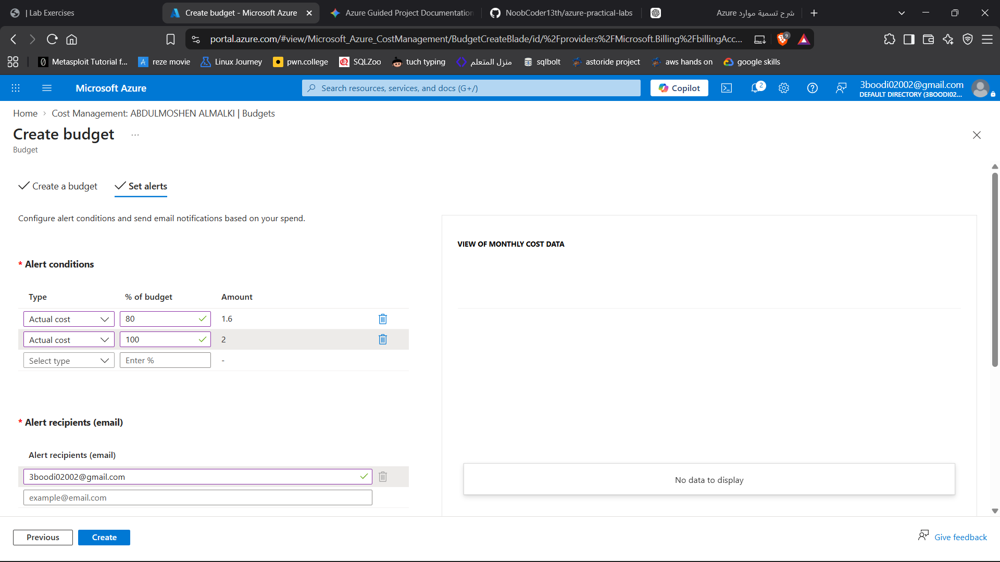
3. **Verify Budget Deployment:** Confirm that the newly created budget appears active within the budgets dashboard.
   * *Screenshot Reference:* 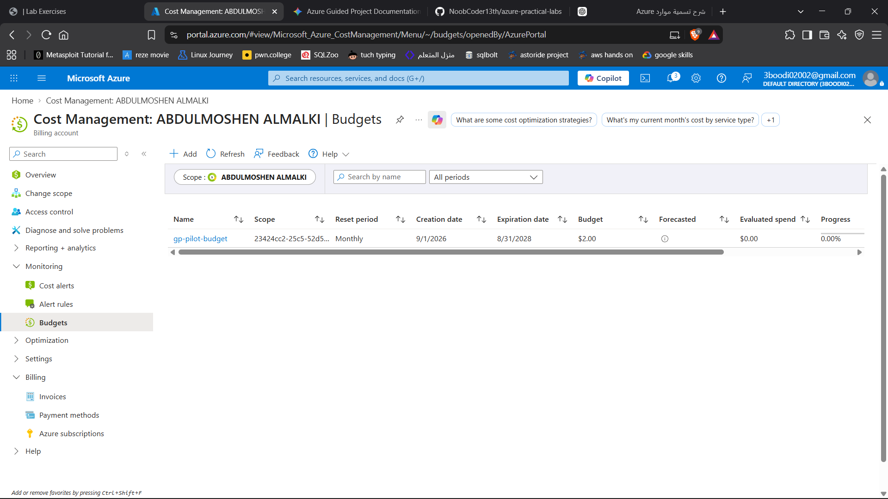

### Phase 3: Azure Policy Assignment & Testing
1. **Assign Policy:** Locate and assign a built-in policy definition restricting allowed deployment regions.
   * *Screenshot References:* 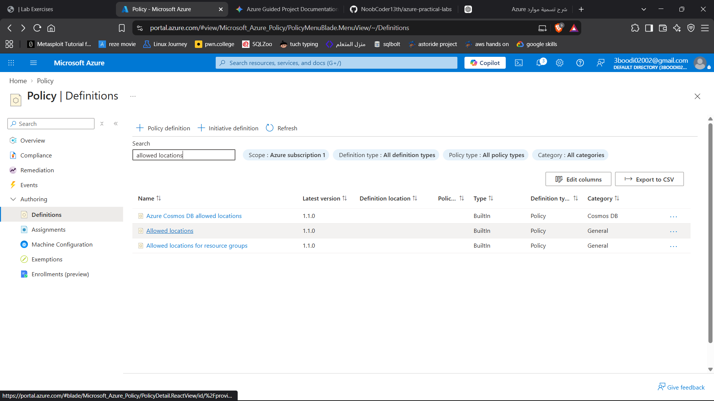, 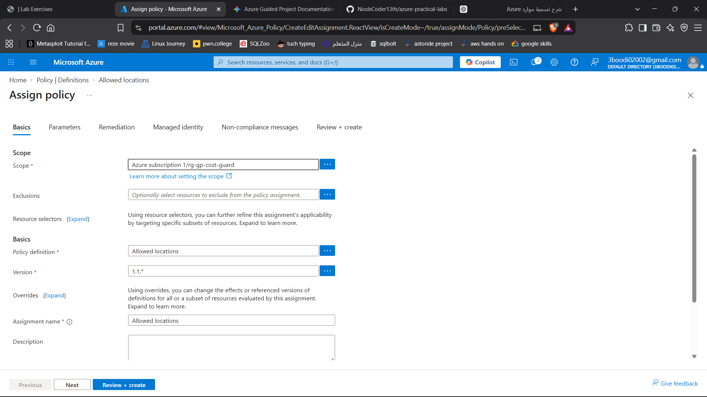, 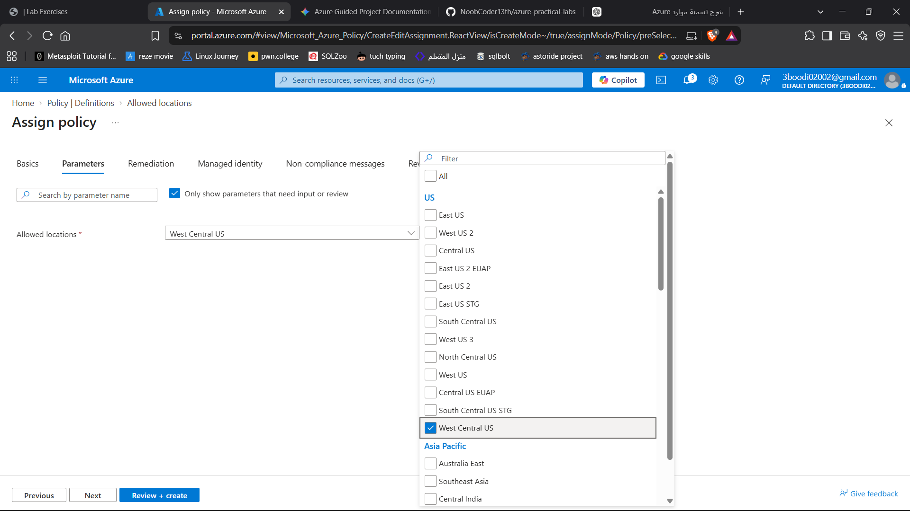
2. **Test Noncompliant Deployment:** Attempt to provision a storage account in a restricted (disallowed) region to test policy enforcement.
   * *Screenshot References:* 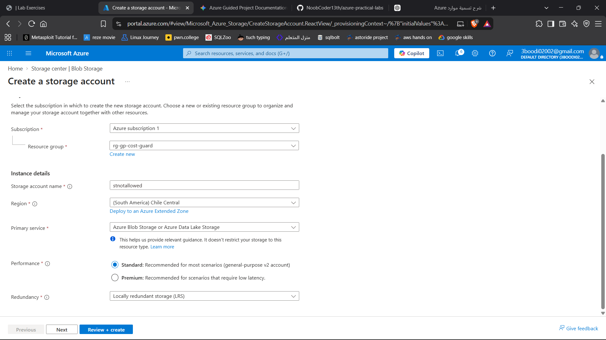, 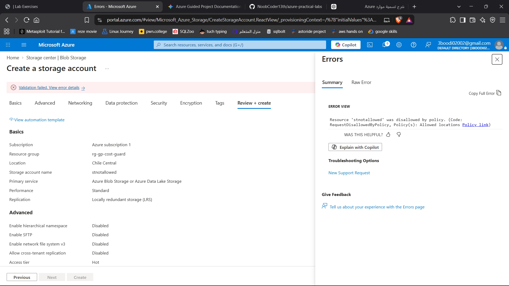

---

## 3. Validation & Compliance Review
* **Policy Compliance Check:** Review the Azure Policy compliance dashboard to verify that blocked deployments and noncompliant states are accurately reported.
  * *Screenshot Reference:* 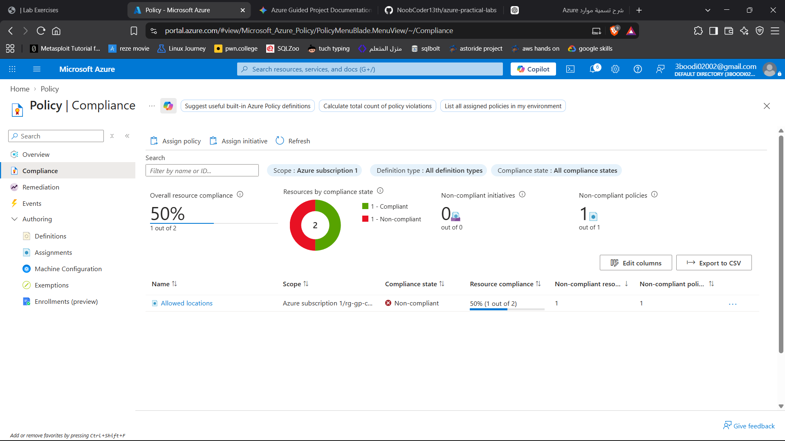

---

## 4. Remediation & Cleanup
To tear down the lab environment and clear governance assignments:
1. **Remove Policy Assignment:** Delete the active region-restriction policy assignment.
   * *Screenshot Reference:* 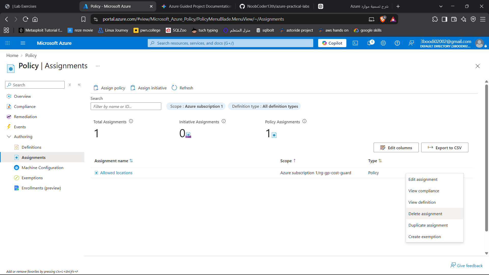
2. **Delete Budget:** Remove the configured cost budget from Cost Management.
   * *Screenshot Reference:* 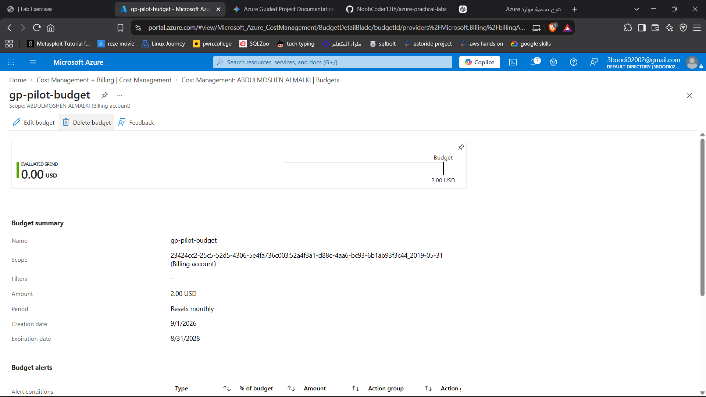
3. **Delete Resource Group:** Delete the primary resource group to cascade-delete all child infrastructure assets.

---

## 5. Key Takeaways & Learnings
* **Proactive Cost Governance:** Combining descriptive resource tags with budget alerts provides early visibility into spending patterns before budgets are exceeded.
* **Automated Guardrails:** Azure Policy shifts governance left by automatically blocking noncompliant infrastructure deployments at the API level.
* **Lifecycle Management:** Regular cleanup of policies, budgets, and resource groups ensures clean test environments and eliminates lingering shadow resources.